# Ditto Vault — Technical Architecture

> Canton Network · CIP-56 · Hybrid On-Chain/Off-Chain Design

---

## Table of Contents

- [1. System Overview](#1-system-overview)
- [2. On-Chain: CIP-56 Token Contracts](#2-on-chain-cip-56-token-contracts)
- [3. Off-Chain: PostgreSQL State](#3-off-chain-postgresql-state)
- [4. Memo-Based Routing](#4-memo-based-routing)
- [5. Transaction Indexer](#5-transaction-indexer)
- [6. Lifecycle Flows](#6-lifecycle-flows)
- [7. Custodial vs Non-Custodial](#7-custodial-vs-non-custodial)
- [8. NAV Oracle & Pricing](#8-nav-oracle--pricing)
- [9. Cross-Chain Bridge](#9-cross-chain-bridge)
- [10. Backend Services](#10-backend-services)
- [11. Security Model](#11-security-model)
- [12. Deployment Architecture](#12-deployment-architecture)
- [13. Featured App Integration](#13-featured-app-integration)
- [14. Why Ditto?](#14-why-ditto)
- [15. References](#15-references)

---

## 1. System Overview

Ditto Vault operates with a **hybrid on-chain/off-chain architecture** across two execution environments:

- **Canton Network** — CIP-56 token contracts for dvUSDC and USDCx (mint, burn, transfer). The only Daml code deployed on-chain.
- **Application Server** — PostgreSQL for vault accounting, queue management, user state, and transaction indexer persistence. Express.js API for business logic and frontend serving.
- **EVM Chains** — yield generation across DeFi money markets (Aave, Morpho, Fluid, Spark), secured by Ditto Network's 16 decentralized operators.

This design keeps on-chain contracts minimal (tokens only), moves all mutable vault state off-chain, and uses memo-based routing for permissionless deposit/withdrawal without requiring user party registration.

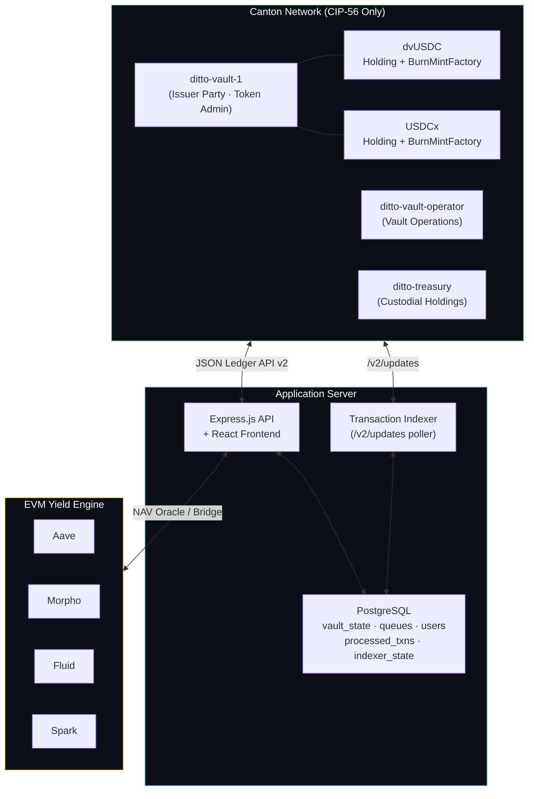

### Why Hybrid?

The initial design placed all vault state on-chain in Daml contracts (VaultState, DepositOffer, WithdrawRequest). Development experience revealed several practical issues:

1. **UTXO churn** — Every VaultState update (NAV, shares, reserves) archives and recreates the contract. The backend must continuously track the latest contract ID.
2. **Query limitations** — Canton's active contracts API ignores template filters and has a 200-element response limit, requiring client-side filtering and pagination.
3. **Transaction cost** — Every queue entry and state change costs Canton traffic credits. Queue management is pure bookkeeping that gains nothing from on-chain execution.
4. **Atomic complexity** — Combining queue clearing + token minting + state update in a single Canton transaction creates deeply nested multi-contract exercises.

Moving vault accounting to PostgreSQL eliminates all of these while preserving the most valuable on-chain component: **CIP-56 token standard compliance** for dvUSDC, enabling wallet compatibility, DvP settlement, and Featured App activity markers.

---

## 2. On-Chain: CIP-56 Token Contracts

The only Daml contracts deployed to Canton are CIP-56 token interfaces — Holding and BurnMintFactory for both dvUSDC and USDCx.

### 2.1 Party Architecture

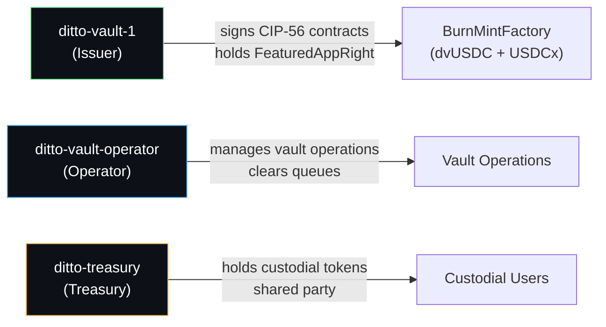

| Party | Role | CIP-47 Significance |
|---|---|---|
| `ditto-vault-1` (Issuer) | Signs all CIP-56 token contracts, holds FeaturedAppRight | Required to be separate from operator by Rule 9 |
| `ditto-vault-operator` | Manages vault operations, clears deposit/withdrawal queues | Operational authority |
| `ditto-treasury` | Holds custodial users' tokens on-chain | Shared custody party |

All CIP-56 commands use `actAs: [issuerPartyId, operatorPartyId]` to satisfy both token-level and operational authorization requirements.

### 2.2 Token Interfaces

Each token implements two CIP-56 interfaces:

| Interface | Type | Purpose |
|---|---|---|
| **Holding** | Consuming | Represents a balance owned by a party. Consumed on transfer/burn. Carries `meta` field for on-chain metadata. |
| **BurnMintFactory** | Nonconsuming | Factory for atomic burn-and-mint operations. Multiple exercises per transaction. Passes `extraArgs.meta` through to created Holdings. |

The nonconsuming nature of BurnMintFactory is critical — it allows multiple token operations (deposits, mints, transfers) to reference the same factory contract in a single atomic Canton transaction.

### 2.3 dvUSDC (Vault Shares)

```
Instrument ID    : { admin: issuerParty, id: "dvUSDC" }
Token Standard   : CIP-56 (Holding + BurnMintFactory)
Precision        : Numeric(10)
Metadata         : extraArgs.meta passed through to Holding.meta
```

dvUSDC represents proportional ownership of the vault's NAV. Share price increases as yield accumulates from EVM strategies.

### 2.4 USDCx (Stablecoin)

```
Instrument ID    : { admin: issuerParty, id: "USDCx" }
Token Standard   : CIP-56 (Holding + BurnMintFactory)
Precision        : Numeric(10)
Metadata         : extraArgs.meta passed through to Holding.meta
```

USDCx is the deposit token. In production, this will be the Canton-native USDC stablecoin via Circle xReserve. During development, the operator mints test USDCx for validation.

### 2.5 UTXO Model

CIP-56 Holdings follow a UTXO model:

- **Mint**: Factory creates new Holding contract(s) — one per output recipient
- **Transfer**: Burns sender's Holding(s), mints new Holding(s) for recipient + change back to sender
- **Burn**: Consumes Holding(s), reduces total supply

Multiple Holdings for the same owner are valid and common. The backend aggregates all holdings to determine a party's total balance.

### 2.6 Metadata Passthrough

The BurnMintFactory's `BurnMint` choice accepts an `extraArgs.meta` field — a `Metadata` map of string key-value pairs. This metadata is propagated through to the `meta` field of every created Holding contract.

The application uses the key `dittonetwork.io/memo` to carry routing information:

```
extraArgs: {
  context: { values: {} },
  meta: { values: { "dittonetwork.io/memo": "{targetPartyId} {optionalMemo}" } }
}
```

This enables the transaction indexer to detect and route token movements by reading on-chain metadata rather than relying solely on API-level memos.

### 2.7 Atomic Batch Operations

The BurnMintFactory `BurnMint` choice accepts multiple input holdings and produces multiple outputs in a single exercise:

```
inputs:   [holdingCid1, holdingCid2, ...]  — consumed
outputs:  [{ owner: partyA, amount: X }, { owner: partyB, amount: Y }, ...]  — created
```

This enables atomic transfers with change, multi-recipient distributions, and combined operations in a single Canton transaction. Both the issuer's and operator's `actAs` authority are required for all CIP-56 operations.

---

## 3. Off-Chain: PostgreSQL State

All vault accounting, queue management, user state, and indexer persistence lives in PostgreSQL.

### 3.1 vault_state (Singleton)

```sql
CREATE TABLE vault_state (
    id              INTEGER PRIMARY KEY DEFAULT 1 CHECK (id = 1),
    nav             DECIMAL(30,10) DEFAULT 0,
    total_shares    DECIMAL(30,10) DEFAULT 0,
    share_price     DECIMAL(30,10) DEFAULT 1,
    vault_reserve   DECIMAL(30,10) DEFAULT 0,
    evm_vault_balance DECIMAL(30,10) DEFAULT 0,
    is_paused       BOOLEAN DEFAULT FALSE,
    last_nav_update TIMESTAMPTZ DEFAULT NOW()
);
```

Enforced as a singleton via `CHECK (id = 1)`. Updated atomically on every deposit clearing, withdrawal clearing, NAV update, and reserve operation.

### 3.2 deposit_queue

```sql
CREATE TABLE deposit_queue (
    id              SERIAL PRIMARY KEY,
    sender_party    VARCHAR(500) NOT NULL,
    amount          DECIMAL(30,10) NOT NULL,
    mint_target     VARCHAR(500) NOT NULL,
    withdrawal_memo TEXT DEFAULT '',
    status          VARCHAR(20) DEFAULT 'pending',
    created_at      TIMESTAMPTZ DEFAULT NOW(),
    cleared_at      TIMESTAMPTZ
);
```

Entries created when USDCx is transferred to the operator with a routing memo. `mint_target` is the Canton party that will receive dvUSDC shares.

### 3.3 withdrawal_queue

```sql
CREATE TABLE withdrawal_queue (
    id               SERIAL PRIMARY KEY,
    sender_party     VARCHAR(500) NOT NULL,
    dvusdc_amount    DECIMAL(30,10) NOT NULL,
    payout_target    VARCHAR(500) NOT NULL,
    withdrawal_memo  TEXT DEFAULT '',
    status           VARCHAR(20) DEFAULT 'pending',
    created_at       TIMESTAMPTZ DEFAULT NOW(),
    cleared_at       TIMESTAMPTZ
);
```

Entries created when dvUSDC is transferred to the operator with a routing memo. `payout_target` is the Canton party that will receive USDCx redemption.

### 3.4 users

```sql
CREATE TABLE users (
    id                  UUID PRIMARY KEY DEFAULT gen_random_uuid(),
    username            VARCHAR(255) UNIQUE NOT NULL,
    password_hash       VARCHAR(255) NOT NULL,
    mode                VARCHAR(20) NOT NULL DEFAULT 'non_custodial'
                        CHECK (mode IN ('custodial', 'non_custodial')),
    party_id            VARCHAR(500) NOT NULL,
    withdrawal_address  VARCHAR(500),
    withdrawal_memo     VARCHAR(500) DEFAULT '',
    referral_code       VARCHAR(100),
    deposit_memo        VARCHAR(500),
    custodial_dvusdcx   DECIMAL(30,10) DEFAULT 0,
    custodial_usdcx     DECIMAL(30,10) DEFAULT 0,
    role                VARCHAR(20) DEFAULT 'user'
                        CHECK (role IN ('admin', 'user')),
    faucet_used         BOOLEAN DEFAULT FALSE,
    created_at          TIMESTAMPTZ DEFAULT NOW()
);
```

Custodial users share a treasury party on-chain. The `custodial_dvusdcx` and `custodial_usdcx` columns track each user's individual balances for both token types.

### 3.5 supported_deposit_tokens

```sql
CREATE TABLE supported_deposit_tokens (
    id          SERIAL PRIMARY KEY,
    token_id    VARCHAR(100) NOT NULL,
    label       VARCHAR(255),
    enabled     BOOLEAN DEFAULT TRUE,
    created_at  TIMESTAMPTZ DEFAULT NOW()
);
```

Operator-configurable. Seeded with `USDCx` and `dvUSDCx` by default. The frontend and API use this to determine which tokens are accepted for deposits.

### 3.6 processed_transactions

```sql
CREATE TABLE processed_transactions (
    id              SERIAL PRIMARY KEY,
    tx_offset       BIGINT NOT NULL,
    tx_id           VARCHAR(500) NOT NULL UNIQUE,
    target_party    VARCHAR(500) NOT NULL,
    instrument_id   VARCHAR(100) NOT NULL,
    amount          DECIMAL(30,10) NOT NULL,
    sender          VARCHAR(500),
    memo            TEXT,
    action          VARCHAR(50) NOT NULL,
    credited_user_id UUID REFERENCES users(id),
    processed_at    TIMESTAMPTZ DEFAULT NOW()
);
```

Deduplication table for the transaction indexer. Each processed on-chain event is recorded with its transaction ID to prevent double-crediting.

### 3.7 indexer_state

```sql
CREATE TABLE indexer_state (
    id                      INTEGER PRIMARY KEY DEFAULT 1,
    last_processed_offset   BIGINT NOT NULL DEFAULT 0,
    updated_at              TIMESTAMPTZ DEFAULT NOW()
);
```

Tracks the last processed Canton ledger offset. On restart, the indexer resumes from this offset instead of re-processing the entire history.

---

## 4. Memo-Based Routing

The memo is the core routing primitive. It eliminates the need for user-signed workflow contracts (DepositOffer, WithdrawRequest) and enables fully permissionless interactions.

### 4.1 Memo Format

```
{targetPartyId} {optionalMemo}
```

Canton party IDs contain no spaces, so the first space-delimited token is always the target address. Everything after is the forwarding memo.

### 4.2 Deposit Memo Examples

```
# Non-custodial: mint shares to my own party
alice::1220abc...   my-reference-123

# Custodial: mint shares to treasury, credit user's DB account
ditto-treasury::1220abc...   550e8400-e29b-41d4-a716-446655440000
```

### 4.3 On-Chain Metadata Key

When the backend performs CIP-56 operations (clearing deposits/withdrawals), it writes the memo into the `extraArgs.meta` field using the key:

```
dittonetwork.io/memo
```

This allows the transaction indexer to detect where minted tokens should be credited by reading on-chain Holding metadata, rather than relying on off-chain state alone.

### 4.4 Why Memos?

The original design used Daml workflow contracts (DepositOffer, WithdrawRequest) signed by the user. This required:
- User party registration on the Canton participant
- User authority (actAs rights) to create the contract
- Operator authority to accept the contract
- Contract ID tracking for queue management

Memo-based routing removes all of this. Any Canton party can deposit by simply transferring tokens to the operator with a self-describing memo. The backend parses the memo, queues the operation in PostgreSQL, and the operator clears it through CIP-56 token operations.

---

## 5. Transaction Indexer

The transaction indexer is a background service that provides automatic detection and routing of token movements.

### 5.1 Architecture

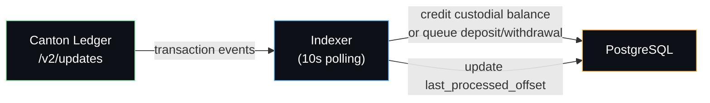

### 5.2 Detection Logic

The indexer polls `POST /v2/updates` every 10 seconds, starting from the last processed offset. It inspects all transaction events for CIP-56 Holding creates where the `meta` field contains a `dittonetwork.io/memo` key.

| Target Party | Instrument | Action |
|---|---|---|
| Treasury | USDCx or dvUSDCx | Parse memo for user UUID → credit `custodial_usdcx` or `custodial_dvusdcx` |
| Operator | USDCx | Parse memo for mint target → insert into `deposit_queue` |
| Operator | dvUSDCx | Parse memo for payout target → insert into `withdrawal_queue` |

### 5.3 Crash Resilience

- **Offset tracking**: `indexer_state.last_processed_offset` is updated after each successful cycle
- **Deduplication**: Each processed transaction is recorded in `processed_transactions` with a unique `tx_id`
- **Atomic operations**: DB credit + processed transaction insert happen in a single PostgreSQL transaction
- **Restart safety**: On restart, the indexer resumes from the last committed offset

### 5.4 Internal Operation Discrimination

The indexer only processes transactions with a `dittonetwork.io/memo` metadata key. Internal operations (raw transfers, setup minting) use empty metadata and are ignored by the indexer.

---

## 6. Lifecycle Flows

### 6.1 Deposit Flow (USDCx → dvUSDC)

```mermaid
sequenceDiagram
    actor User
    participant BE as Backend
    participant DB as PostgreSQL
    participant CN as Canton (CIP-56)

    User->>BE: POST /api/deposit { senderPartyId, amount, memo }

    rect rgb(30, 50, 30)
        Note over BE,CN: On-Chain: Transfer USDCx
        BE->>CN: BurnMintFactory_BurnMint<br/>Burn sender USDCx<br/>Mint to operator
    end

    BE->>DB: INSERT INTO deposit_queue<br/>(sender, amount, mint_target)
    BE-->>User: Queued

    Note over BE: Operator clears queue

    BE->>DB: Read pending deposits
    BE->>DB: Read vault_state (sharePrice)
    Note over BE: sharesToMint = amount / sharePrice

    rect rgb(30, 50, 30)
        Note over BE,CN: On-Chain: Mint dvUSDC (with memo metadata)
        BE->>CN: BurnMintFactory_BurnMint<br/>Mint dvUSDC to mint_target<br/>meta: dittonetwork.io/memo
    end

    BE->>DB: UPDATE vault_state<br/>nav += amount<br/>total_shares += minted
    BE->>DB: UPDATE deposit_queue SET status = 'cleared'

    alt mint_target is treasury
        Note over BE: Direct DB credit in clearing code
        BE->>DB: Credit custodial_dvusdcx by memo UUID
    end

    BE-->>User: Shares minted
```

### 6.2 Withdrawal Flow (dvUSDC → USDCx)

```mermaid
sequenceDiagram
    actor User
    participant BE as Backend
    participant DB as PostgreSQL
    participant CN as Canton (CIP-56)

    User->>BE: POST /api/withdraw { senderPartyId, dvUsdcAmount, memo }

    rect rgb(30, 50, 30)
        Note over BE,CN: On-Chain: Transfer dvUSDC
        BE->>CN: BurnMintFactory_BurnMint<br/>Burn sender dvUSDC<br/>Mint to operator
    end

    BE->>DB: INSERT INTO withdrawal_queue<br/>(sender, amount, payout_target)
    BE-->>User: Queued

    Note over BE: Operator clears queue

    BE->>DB: Read pending withdrawals
    BE->>DB: Read vault_state (sharePrice)
    Note over BE: redemption = dvUsdcAmount × sharePrice

    rect rgb(30, 50, 30)
        Note over BE,CN: On-Chain: Burn dvUSDC + Transfer USDCx (with memo metadata)
        BE->>CN: BurnMintFactory_BurnMint<br/>Burn operator's dvUSDC
        BE->>CN: BurnMintFactory_BurnMint<br/>Transfer USDCx to payout_target<br/>meta: dittonetwork.io/memo
    end

    BE->>DB: UPDATE vault_state<br/>nav -= redemption<br/>total_shares -= burned
    BE->>DB: UPDATE withdrawal_queue SET status = 'cleared'

    alt payout_target is treasury
        Note over BE: Direct DB credit in clearing code
        BE->>DB: Credit custodial_usdcx by memo UUID
    end

    BE-->>User: USDCx returned
```

### 6.3 Custodial Deposit (Two Paths)

Custodial users can receive deposits through two paths:

**Path A: Via `/api/deposit`** — The deposit API accepts a bare user UUID or `{treasuryPartyId} {userUUID}` as the memo. The backend detects the custodial user, transfers tokens to the treasury on-chain (with `dittonetwork.io/memo` metadata for crash recovery), and credits the user's DB balance immediately. A dedup record is written to `processed_transactions` so the indexer skips the same transaction.

**Path B: Via external wallet** — Any wallet sends tokens directly to the treasury with the user's UUID as memo. The transaction indexer detects the arrival and credits the balance.

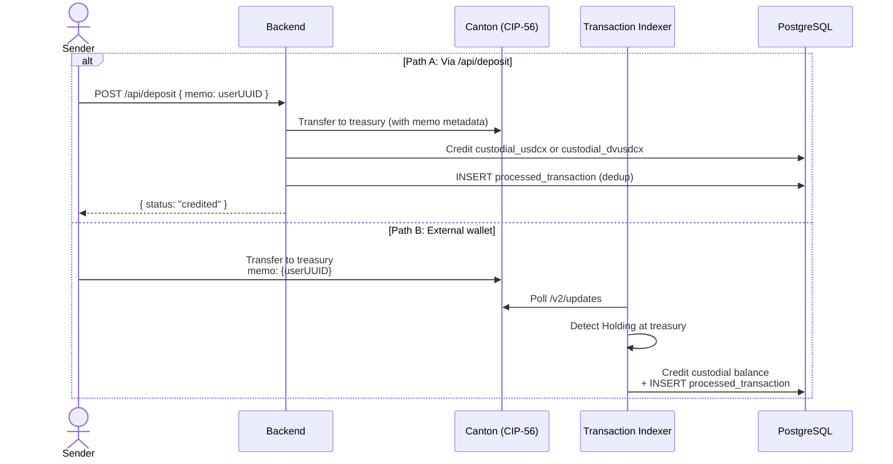

### 6.4 Custodial Mint (USDCx → dvUSDCx)

A custodial user converts their USDCx balance into vault shares, reusing the standard deposit pipeline.

```mermaid
sequenceDiagram
    actor User
    participant BE as Backend
    participant DB as PostgreSQL
    participant CN as Canton (CIP-56)
    participant IDX as Indexer

    User->>BE: POST /api/user/custodial-mint { dvUsdcAmount }
    BE->>DB: Debit custodial_usdcx

    rect rgb(30, 50, 30)
        Note over BE,CN: Transfer USDCx: treasury → operator
        BE->>CN: BurnMintFactory_BurnMint<br/>meta: {treasuryPartyId} {userUUID}
    end

    BE->>DB: INSERT INTO deposit_queue<br/>(treasury, amount, treasury as mint_target)
    BE-->>User: Queued for clearing

    Note over BE: Operator clears deposits
    BE->>CN: Mint dvUSDCx to treasury (with memo metadata)
    BE->>DB: Update vault_state
    BE->>DB: Direct credit custodial_dvusdcx<br/>(inline in clearing code)
```

### 6.5 Custodial Burn (dvUSDCx → USDCx)

A custodial user converts vault shares back into USDCx, reusing the standard withdrawal pipeline.

```mermaid
sequenceDiagram
    actor User
    participant BE as Backend
    participant DB as PostgreSQL
    participant CN as Canton (CIP-56)
    participant IDX as Indexer

    User->>BE: POST /api/user/custodial-burn { dvUsdcAmount }
    BE->>DB: Debit custodial_dvusdcx

    rect rgb(30, 50, 30)
        Note over BE,CN: Transfer dvUSDCx: treasury → operator
        BE->>CN: BurnMintFactory_BurnMint<br/>meta: {treasuryPartyId} {userUUID}
    end

    BE->>DB: INSERT INTO withdrawal_queue<br/>(treasury, amount, treasury as payout_target)
    BE-->>User: Queued for clearing

    Note over BE: Operator clears withdrawals
    BE->>CN: Burn dvUSDCx + mint USDCx to treasury (with memo metadata)
    BE->>DB: Update vault_state
    BE->>DB: Direct credit custodial_usdcx<br/>(inline in clearing code)
```

### 6.6 Share Transfer

```mermaid
sequenceDiagram
    actor User
    participant BE as Backend
    participant DB as PostgreSQL
    participant CN as Canton (CIP-56)

    User->>BE: POST /api/user/transfer-shares { toAddress, toMemo, amount }

    alt Custodial sender
        BE->>DB: Debit custodial_dvusdcx
        rect rgb(30, 50, 30)
            Note over BE,CN: On-Chain: Transfer from Treasury
            BE->>CN: BurnMintFactory_BurnMint<br/>Burn treasury dvUSDC<br/>Mint to destination
        end
        Note over BE: If on-chain fails → rollback DB debit
    else Non-custodial sender
        rect rgb(30, 50, 30)
            Note over BE,CN: On-Chain: Direct Transfer
            BE->>CN: BurnMintFactory_BurnMint<br/>Burn sender dvUSDC<br/>Mint to destination
        end
    end

    alt Destination is custodial user
        BE->>DB: Credit custodial_dvusdcx for recipient
    end

    BE-->>User: Transfer complete
```

The backend implements **DB rollback** for custodial transfers: if the on-chain CIP-56 operation fails after the sender's DB balance has been debited, the debit is reversed.

---

## 7. Custodial vs Non-Custodial

### 7.1 Non-Custodial Mode

The user holds their own Canton party and interacts permissionlessly:

- **Registration**: Backend allocates a Canton party and grants ledger rights
- **Deposits**: User sends USDCx to operator with their party ID as memo
- **Shares**: dvUSDC is minted directly to the user's party on-chain
- **Withdrawals**: User sends dvUSDC to operator with their destination address
- **Full control**: User holds CIP-56 tokens directly, can transfer peer-to-peer

### 7.2 Custodial Mode

The user gets a managed account backed by a shared treasury party:

- **Registration**: User provides a referral code, gets a UUID and deposit memo
- **Deposit memo format**: `{treasuryPartyId} {userUUID}`
- **Two balances tracked**: `custodial_usdcx` (stablecoin) and `custodial_dvusdcx` (vault shares)
- **Four actions available**: Mint dvUSDCx, Burn dvUSDCx, Withdraw USDCx, Withdraw dvUSDCx
- **Automatic crediting**: Transaction indexer detects treasury deposits and credits the correct user
- **Transfers**: Backend debits sender, transfers on-chain, credits recipient if custodial

### 7.3 Treasury Party

A dedicated Canton party (`ditto-treasury`) holds all custodial users' tokens on-chain. Two invariants are maintained:

1. On-chain treasury dvUSDCx ≥ Σ(custodial users' `custodial_dvusdcx`)
2. On-chain treasury USDCx ≥ Σ(custodial users' `custodial_usdcx`)

These invariants are maintained by crediting/debiting the DB atomically with on-chain operations, with rollback protection on failures.

### 7.4 Unified Flow Architecture

Custodial operations reuse the same deposit/withdrawal pipeline as non-custodial:

| Custodial Action | Under the Hood |
|---|---|
| Mint dvUSDCx | Treasury sends USDCx to operator (deposit queue) → operator clears → dvUSDCx minted to treasury → clearing code directly credits `custodial_dvusdcx` |
| Burn dvUSDCx | Treasury sends dvUSDCx to operator (withdrawal queue) → operator clears → USDCx minted to treasury → clearing code directly credits `custodial_usdcx` |
| Withdraw USDCx | Backend debits `custodial_usdcx`, transfers from treasury on-chain (DB rollback on chain failure) |
| Withdraw dvUSDCx | Backend debits `custodial_dvusdcx`, transfers from treasury on-chain (DB rollback on chain failure) |

---

## 8. NAV Oracle & Pricing

### 8.1 Share Price

```
sharePrice = nav / totalShares    (when totalShares > 0, else 1.0)

On deposit:   sharesToMint    = depositAmount / sharePrice
On withdraw:  redemptionAmount = sharesToBurn × sharePrice
Yield:        sharePrice rises as EVM yield increases NAV
```

### 8.2 NAV Update Flow

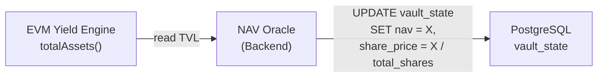

1. Backend reads total vault value from EVM vault contracts via RPC
2. Applies management fee accrual
3. Updates `nav` and `share_price` in PostgreSQL
4. No on-chain transaction required for NAV updates — purely off-chain

### 8.3 Fee Accrual

```
annualFeeRate = feeRateBps / 10000
timeFraction  = secondsSinceLastUpdate / secondsPerYear
accruedFee    = grossNAV × annualFeeRate × timeFraction
netNAV        = grossNAV - accruedFee
```

---

## 9. Cross-Chain Bridge

### 9.1 Current State (MVP)

No actual fund movement between Canton and EVM. The NAV Oracle reads EVM vault TVL and posts it to PostgreSQL. Reserve management (fund vault, bridge to/from EVM) is bookkeeping via DB updates. CIP-56 USDCx on Canton is test-minted by the operator.

### 9.2 Production (Phase 2+)

Integration with **Circle xReserve** for actual USDCx ↔ USDC bridging:

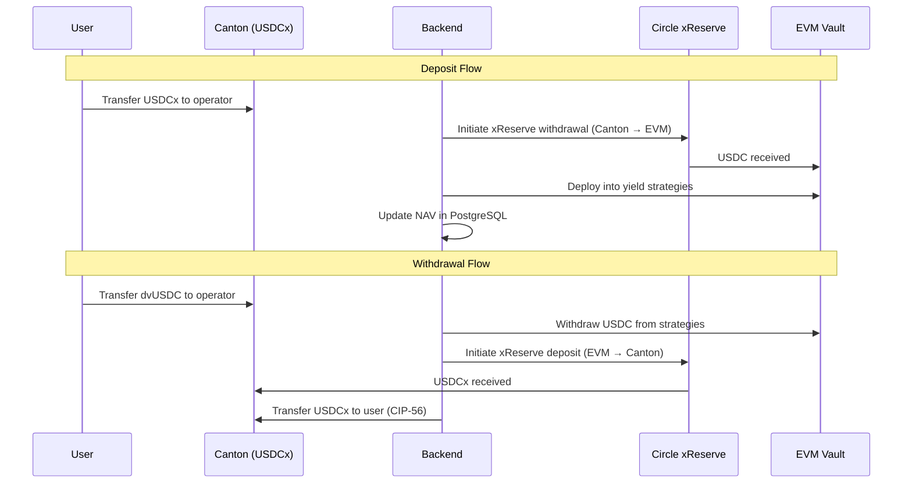

---

## 10. Backend Services

The backend is a single Express.js server handling all responsibilities:

### 10.1 Startup Sequence

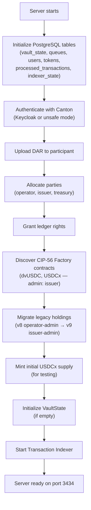

### 10.2 Authentication

Dual-mode authentication for Canton Ledger API:

| Mode | Mechanism | Use Case |
|---|---|---|
| `keycloak` | OAuth2 token from Keycloak IdP | Production validators |
| `none` | No auth header, `userId: ledger-api-user` | Development / unsafe mode |

User authentication is separate — JWT-based with bcryptjs password hashing.

### 10.3 Canton Ledger API Integration

All on-chain interactions go through Canton's JSON Ledger API v2:

| Operation | API Endpoint |
|---|---|
| Upload DAR | `POST /v2/packages` |
| Allocate party | `POST /v2/parties` |
| Submit commands | `POST /v2/commands/submit-and-wait-for-transaction` |
| Query contracts | `POST /v2/state/active-contracts` |
| Get ledger offset | `GET /v2/state/ledger-end` |
| Stream updates | `POST /v2/updates` |

The backend uses `actAs: [issuerPartyId, operatorPartyId]` for all CIP-56 commands. User parties are included as `actAs` when their authority is needed (e.g., transferring their tokens).

### 10.4 Smart Routing (Controller Dashboard)

The controller dashboard implements intelligent routing for token sends:

| Token | Memo? | Destination | Route |
|---|---|---|---|
| USDCx | Yes | Any | `POST /api/deposit` (enters deposit queue) |
| dvUSDC | Yes | Treasury | `POST /api/deposit-shares` (instant custodial credit) |
| dvUSDC | Yes | Operator | `POST /api/withdraw` (enters withdrawal queue) |
| Any | No | Any | `POST /api/transfer` (raw CIP-56 transfer) |

### 10.5 Registry API

The `POST /api/registry/transfer-factory` endpoint provides external wallets with the information needed to interact with Ditto Vault tokens:

- Factory contract IDs for dvUSDCx and USDCx
- Instrument IDs with issuer party as admin
- Operator, issuer, and treasury party IDs
- Memo format and metadata key specification

---

## 11. Security Model

### 11.1 Canton Security

| Control | Implementation |
|---|---|
| **CIP-56 authorization** | All BurnMintFactory operations require both issuer's and operator's `actAs` authority |
| **Party separation** | Issuer (`ditto-vault-1`) is separate from operator, satisfying CIP-47 Rule 9 |
| **Atomic execution** | Multi-command submissions are all-or-nothing |
| **Privacy** | Canton's sub-transaction privacy ensures parties see only their own contracts |
| **Audit trail** | Every token creation and archival recorded on the Canton ledger |
| **UTXO integrity** | Holdings can only be consumed by authorized exercises |
| **Metadata integrity** | On-chain metadata in Holdings enables verifiable transaction routing |

### 11.2 Application Security

| Control | Implementation |
|---|---|
| **JWT authentication** | bcryptjs password hashing, signed JWT tokens |
| **Role-based access** | `user` and `admin` roles with middleware enforcement |
| **Operator endpoint protection** | All operator APIs (state, clearing, NAV, pause, bridge, transfers, token config) require admin JWT |
| **Controller login gate** | Full-screen auth overlay on operator dashboard, session-scoped JWT, auto-logout on expiry |
| **Domain-level filtering** | Reverse proxy blocks operator APIs on the user-facing domain |
| **DB rollback** | Custodial transfers revert DB debit if on-chain operation fails |
| **Pause mechanism** | Operator can pause all vault operations instantly |
| **Input validation** | Decimal precision capped at 10 digits (Canton Numeric limit) |
| **Configurable tokens** | Only operator-whitelisted tokens accepted for deposits |

### 11.3 Indexer Security

| Control | Implementation |
|---|---|
| **Deduplication** | `processed_transactions` table with unique `tx_id` prevents double-crediting |
| **Atomic processing** | DB credit + transaction record in single PostgreSQL transaction |
| **Metadata discrimination** | Only transactions with `dittonetwork.io/memo` key are processed |
| **Offset persistence** | Crash-safe resume from last committed ledger offset |

### 11.4 Custodial Integrity

The treasury balance invariant: on-chain treasury tokens ≥ Σ(custodial users' DB balances). Maintained by:

- Deposit via `/api/deposit` with UUID memo: transfers to treasury on-chain first, then credits DB, then writes dedup record to `processed_transactions`. On-chain memo metadata enables crash recovery (indexer handles it on restart).
- Clearing operations (`process-deposits`, `process-withdrawals`): when target is treasury, credits custodial balance inline with direct DB UPDATE.
- Debiting DB balance before on-chain transfer, with inner try-catch rollback on chain failure (all custodial withdrawal endpoints).
- Direct share deposits (`deposit-shares`) credit DB only after confirmed on-chain transfer to treasury.
- Transaction indexer uses atomic PostgreSQL transactions for all credits. Three dedup layers prevent double-counting: (1) treasury remainder skip via ExercisedEvent Archive detection, (2) clearing dedup checking recent cleared queue entries, (3) `processed_transactions` unique tx_id constraint.

### 11.5 EVM Security

| Control | Implementation |
|---|---|
| **Operator decentralization** | 16 operators across Eigenlayer and Symbiotic |
| **Strategy constraints** | Whitelisted protocols only (Aave, Morpho, Fluid, Spark) |
| **Autonomous execution** | No manual intervention, guard-rail protected |
| **Economic security** | $200M+ TVL backing across the operator set |

---

## 12. Deployment Architecture

### 12.1 Infrastructure

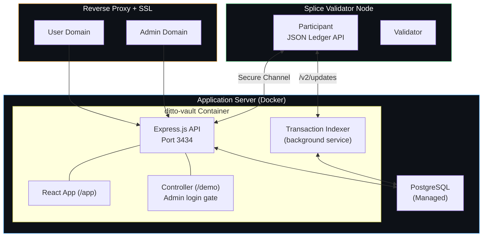

### 12.2 Docker Deployment

The application runs as a Docker container with `restart: unless-stopped`:

- **Image**: `node:20-slim` + python3 (for DAR manifest parsing)
- **Network**: Host mode (direct access to Canton Ledger API)
- **Volumes**: DAR files mounted read-only, persistent data directory
- **Database**: External PostgreSQL (managed service)

### 12.3 Network Isolation

User-facing and operator-facing interfaces are served on separate domains behind a reverse proxy:

- **User domain** — serves the React app and proxies only public and user-scoped API endpoints. Operator APIs and the controller dashboard are not reachable.
- **Admin domain** — proxies all endpoints. Server-side JWT middleware enforces admin authorization on operator routes.

SSL is terminated at the edge with encrypted origin connections.

### 12.4 Canton Connectivity

Two authentication modes for connecting to the Canton Ledger API:

| Environment | Auth Mode | Connection |
|---|---|---|
| Development | `none` (unsafe) | Direct or SSH tunnel to validator |
| Production | `keycloak` | OAuth2 tokens from Keycloak IdP |

### 12.5 Contract Packages

```
ditto-vault-contracts/
├── daml.yaml                                        # sdk-version: 3.4.10, name: ditto-vault-v9
├── dars/                                            # CIP-56 + Featured App data dependencies
│   ├── splice-api-token-metadata-v1-1.0.0.dar
│   ├── splice-api-token-holding-v1-1.0.0.dar
│   ├── splice-api-token-burn-mint-v1-1.0.0.dar
│   ├── splice-api-token-transfer-instruction-v1-1.0.0.dar
│   ├── splice-api-featured-app-v2-1.0.0.dar
│   └── splice-util-featured-app-proxies-1.2.1.dar
└── daml/
    └── DittoVault/
        ├── DvUsdcToken.daml      # dvUSDC Holding + BurnMintFactory (CIP-56, meta passthrough)
        └── UsdcxToken.daml       # USDCx Holding + BurnMintFactory (CIP-56, meta passthrough)
```

The DAR is uploaded automatically on server startup. Package IDs are extracted from the DAR manifest. On startup, any legacy holdings (from prior package versions with different admin parties) are automatically migrated to the current issuer-admin format.

---

## 13. Featured App Integration

### 13.1 CIP-47 Compliance

Ditto Vault satisfies the requirements for Canton Featured App Activity Markers:

| Requirement | Implementation |
|---|---|
| **CIP-56 compliance** | Both tokens implement Holding + BurnMintFactory interfaces |
| **Party separation (Rule 9)** | Issuer (`ditto-vault-1`) separate from operator |
| **Economically motivated** | Every transaction serves a genuine user need |
| **Metadata support** | `dittonetwork.io/memo` key in Holdings for verifiable routing |

### 13.2 Data Dependencies

The following Featured App Splice packages are included as Daml data dependencies:

- `splice-api-featured-app-v2-1.0.0.dar` — FeaturedAppRightV2 with weighted markers
- `splice-util-featured-app-proxies-1.2.1.dar` — WalletUserProxy for automatic marker creation

### 13.3 Marker-Eligible Transactions

Each of these on-chain events qualifies for one Featured App Activity Marker:

| Event | On-chain Action |
|---|---|
| Deposit clearing | USDCx received → dvUSDCx minted to user |
| Withdrawal clearing | dvUSDCx burned → USDCx sent to user |
| Custodial mint | Treasury USDCx → operator → clear → dvUSDCx to treasury |
| Custodial burn | Treasury dvUSDCx → operator → clear → USDCx to treasury |
| Peer-to-peer transfer | Any wallet sends dvUSDCx to any wallet |
| External transfer (future) | CIP-56 TransferFactory transfer between parties |

### 13.4 WalletUserProxy Integration (Planned)

At MainNet launch, the `WalletUserProxy` pattern will enable automatic marker creation for user transactions:

- Users call `WalletUserProxy_TransferFactory_Transfer` instead of direct token choices
- Automatically creates `FeaturedAppActivityMarker` for each transaction
- Provider controls reward split (`providerWeight` / `userWeight`)
- Supports batch transfers with efficient weighted markers (V2 `weight` parameter)

---

## 14. Why Ditto?

Ditto Network provides the infrastructure backbone that makes autonomous yield generation on Canton possible — without relying on centralized intermediaries or manual treasury operations.

### Decentralized Operator Network

Vault transactions on EVM are secured by **16 institutional-grade operators** actively restaked across **Eigenlayer** and **Symbiotic**. This decentralized operator set eliminates single points of failure and ensures that no individual entity can unilaterally control fund movements or strategy execution.

### Economic Security

Operators collectively secure approximately **$200M in total value locked**, providing strong economic guarantees against malicious behavior. Slashing conditions enforced by the restaking protocols align operator incentives with depositor protection.

### Autonomous Execution with Guard Rails

Yield strategies on EVM run **fully autonomously** — allocations across Aave, Morpho, Fluid, and Spark are rebalanced without manual intervention. Every rebalancing action is validated by an on-chain **guard and risk management system** that enforces:

- **Whitelisted protocols only** — the allocator cannot deposit into unapproved venues
- **Position limits** — maximum exposure per protocol to prevent concentration risk
- **Slippage protection** — rebalance transactions revert if execution deviates beyond thresholds
- **Health factor monitoring** — automated de-risking if collateral ratios approach liquidation levels

### What This Means for Canton

Canton participants interacting with Ditto Vault benefit from institutional-grade security and automation without trusting a single operator. The yield flowing back to dvUSDC holders is generated by battle-tested infrastructure that has been live on Ethereum mainnet — now extended to Canton through CIP-56 tokenization.

---

## 15. References

| Resource | Link |
|---|---|
| CIP-56 Specification | [github.com/global-synchronizer-foundation/cips](https://github.com/global-synchronizer-foundation/cips/blob/main/cip-0056/cip-0056.md) |
| CIP-47 Featured App Markers | [github.com/global-synchronizer-foundation/cips](https://github.com/global-synchronizer-foundation/cips/blob/main/cip-0047/cip-0047.md) |
| Canton Quickstart | [github.com/digital-asset/cn-quickstart](https://github.com/digital-asset/cn-quickstart) |
| Splice Token Standard APIs | [docs.dev.global.canton.network](https://docs.dev.global.canton.network.sync.global/app_dev/token_standard/index.html) |
| BurnMint API | [Splice-Api-Token-BurnMintV1](https://docs.dev.global.canton.network.sync.global/app_dev/api/splice-api-token-burn-mint-v1/Splice-Api-Token-BurnMintV1.html) |
| Featured App V2 API | [Splice-Api-FeaturedAppRightV2](https://docs.dev.global.canton.network.sync.global/app_dev/api/splice-api-featured-app-v2/Splice-Api-FeaturedAppRightV2.html) |
| WalletUserProxy | [Splice-Util-FeaturedApp-WalletUserProxy](https://docs.dev.global.canton.network.sync.global/app_dev/api/splice-util-featured-app-proxies/Splice-Util-FeaturedApp-WalletUserProxy.html) |
| Splice Wallet Kernel SDK | [github.com/hyperledger-labs/splice-wallet-kernel](https://github.com/hyperledger-labs/splice-wallet-kernel) |
| Registry Utility | [docs.digitalasset.com](https://docs.digitalasset.com/utilities/devnet/overview/registry-user-guide/token-standard.html) |
| Activity Markers | [docs.digitalasset.com](https://docs.digitalasset.com/utilities/devnet/overview/registry-user-guide/activity-markers.html) |
| Circle xReserve | [developers.circle.com](https://developers.circle.com/xreserve/tutorials/deposit-usdc-on-ethereum-for-usdcx-on-canton) |
| Featured App Request | [canton.foundation](https://canton.foundation/featured-app-request/) |
| Daml Documentation | [docs.digitalasset.com](https://docs.digitalasset.com/build/3.4/tutorials/smart-contracts/intro.html) |
| Cantonomics for App Builders | [canton.network/blog](https://www.canton.network/blog/cantonomics-for-app-builders) |

---

*Ditto Network — [dittonetwork.io](https://dittonetwork.io) · [@Ditto_Network](https://x.com/Ditto_Network) · [GitHub](https://github.com/dittonetwork)*
