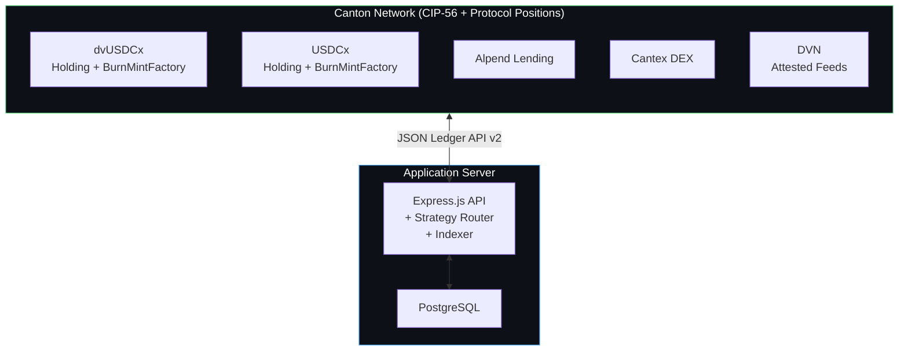
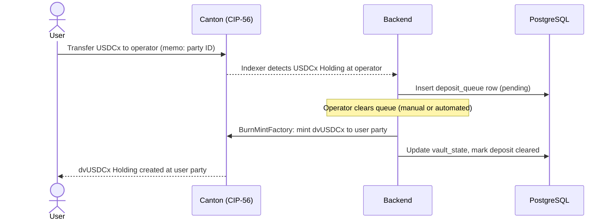
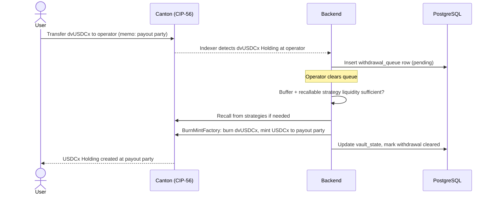
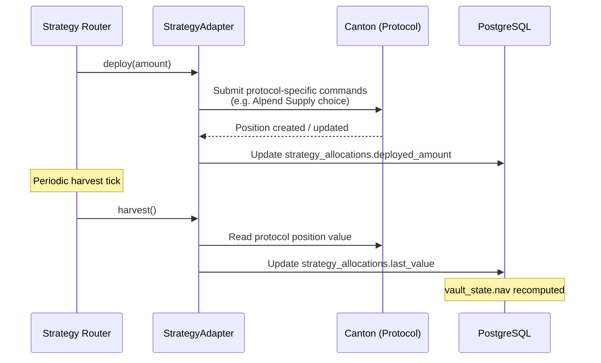

# Ditto Vault — Technical Architecture

> Canton Network · CIP-56 · Hybrid On-Chain / Off-Chain Design

---

## Table of Contents

- [1. System overview](#1-system-overview)
- [2. On-chain: CIP-56 token contracts](#2-on-chain-cip-56-token-contracts)
- [3. Off-chain: PostgreSQL state](#3-off-chain-postgresql-state)
- [4. Memo-based routing](#4-memo-based-routing)
- [5. Lifecycle flows](#5-lifecycle-flows)
- [6. Strategy router](#6-strategy-router)
- [7. Ditto Verification Network (DVN)](#7-ditto-verification-network-dvn)
- [8. NAV: derivation and on-chain publication](#8-nav-derivation-and-on-chain-publication)
- [9. Backend services](#9-backend-services)
- [10. Security model](#10-security-model)
- [11. Deployment architecture](#11-deployment-architecture)

---

## 1. System overview

Ditto Vault operates with a **hybrid on-chain / off-chain architecture** spanning two execution environments, both inside Canton:

- **Canton Network** — CIP-56 token contracts for every dvToken in the platform lineup (`dvUSDCx`, `dvUSDCx-LOCK90`, `dvCC`, …) plus the base assets (USDCx, CC, CBTC), `NavAnchor` publications per dvToken, and protocol positions on Alpend and Cantex. The on-chain plane carries token state, party authorization, protocol allocations, and verifiable NAV.
- **Application Server** — PostgreSQL for vault accounting and queue state, Express.js for API and frontend serving, the strategy router for allocation logic.

There is no third execution environment. The vault is fully Canton-native: no bridges, no off-Canton custody, no synthetic exposure.



This design keeps the on-chain surface minimal — only token contracts and protocol-position contracts — while moving all mutable vault state (NAV, queues, share price, per-strategy allocations) off-chain. Memo-based routing enables permissionless deposits and withdrawals without requiring user party registration on the vault's participant.

---

## 2. On-chain: CIP-56 token contracts

The vault relies on the Splice CIP-56 token standard for all token operations. Two classes of token are involved:

| Token class | Issuer | Standard | Purpose |
|---|---|---|---|
| **dvTokens** (`dvUSDCx`, `dvUSDCx-LOCK90`, `dvUSDCx-LOCK1Y`, `dvCC`, `dvCBTC`, …) | `ditto-vault-1` | CIP-56 Holding + BurnMintFactory per instrument | Vault shares — one CIP-56 instrument per vault |
| **Base assets** (`USDCx`, `CC`, `CBTC`, …) | External (Circle for USDCx on MainNet; SVs for CC; etc.) | CIP-56 Holding + transfer/burn-mint as appropriate to issuer | User-deposited assets that the operator routes into strategies |

The platform issues dvTokens; it does not issue base assets. On DevNet a test party `usdcx-issuer` admins a placeholder USDCx for development purposes only.

### Holding (UTXO model)

Each balance is represented by one or more `Holding` contracts, parameterized by `instrumentId = (admin, id)`, `owner`, `amount`, and `meta`. For dvTokens, the instrument admin is `ditto-vault-1`. For USDCx and other base assets, the admin is the external issuer (Circle, etc.). Holdings are immutable: balance changes are achieved by burning input Holdings and minting new ones.

### BurnMintFactory (atomic batches)

Mint, burn, and transfer operations are exercised through a single nonconsuming `BurnMintFactory` contract per dvToken instrument. Multi-Holding operations are atomic: the entire batch (e.g., burn 1 input + mint 2 outputs) succeeds or fails together. This eliminates partial-state hazards in deposit/withdraw clearing and in strategy router operations that move base assets between the operator party and protocol positions.

### Multi-vault topology

The on-chain topology supports an arbitrary number of vault products. Each vault is identified by its `instrumentId.id` (e.g., `dvUSDCx`, `dvUSDCx-LOCK90`, `dvCC`), and each has its own `BurnMintFactory` instance under the shared `ditto-vault-1` issuer. The off-chain backend keys vault state by `instrumentId`: each vault has its own row in `vault_state`, its own queues, and its own `strategy_allocations`.

Adding a new vault requires:
1. Issuing a new CIP-56 instrument (Daml command on `ditto-vault-1`).
2. Inserting a new `vault_state` row keyed by the new instrument ID.
3. Configuring the strategy mix (which adapters, target weights) for the new vault.
4. Registering a new `FeaturedAppRight` for the instrument with the Canton Foundation.

There is no code change required — the platform's adapter framework, indexer, and accounting are vault-agnostic.

### Party isolation (CIP-47 Rule 10)

The Featured App Coupon Guidance (revised 22 April 2026, effective 27 April 2026 21:00 UTC) requires that an asset-issuer Party cannot also operate as a wallet, DEX, market maker, lending protocol, payment processor, or any other fee-generating function. The platform splits roles across distinct Parties:

| Party | Function | Why isolated |
|---|---|---|
| **`ditto-vault-1`** | CIP-56 issuer for every dvToken — only function | Required by Rule 10 to remain marker-eligible as asset issuer |
| **`ditto-vault-operator`** | Vault operations: holds reserves, executes strategy allocations, processes deposit/withdraw queues, interacts with Alpend and Cantex | Lending and DEX interaction are fee-generating functions; cannot share a Party with the issuer |
| **`ditto-oracle`** | Operator-quorum-attested oracle feeds (Phase 5+) | Oracle is a separate fee-generating function; must be its own Party |
| **`ditto-vault-mm`** *(future)* | Market-making service for dvToken secondary liquidity | Market-making is a fee-generating function; must be its own Party |

Marker submission is performed by an automation service. Markers are submitted as `FeaturedAppActivityMarker` contracts with `provider = ditto-vault-1` and `beneficiary = ditto-vault-1`; the submitting party may be the operator (acting on the issuer's behalf via authorization), but reward attribution belongs to the issuer per Rule 10. Submissions are batched per the methodology in the official guidance.

### Metadata passthrough

The BurnMintFactory propagates the `extraArgs.meta` field into the `meta` field of every created Holding. The vault uses one canonical key:

```
dittonetwork.io/memo  →  "<recipient_party_id> [optional_freeform]"
```

The transaction indexer watches incoming Holdings to the operator party for this key and routes the transaction (deposit, withdrawal, transfer) accordingly.

---

## 3. Off-chain: PostgreSQL state

All mutable vault state lives in PostgreSQL. The on-chain plane is the source of truth for token ownership; PostgreSQL is the source of truth for accounting and queue state.

| Table | Purpose |
|---|---|
| `vault_state` | One row per dvToken instrument: NAV, total shares, share price, idle reserve, paused flag |
| `strategy_allocations` | One row per (instrument_id, strategy_id, asset): deployed amount, last marked value, last harvest timestamp |
| `deposit_queue` | Pending base-asset → dvToken conversions with `pending` / `cleared` / `rejected`, keyed by target dvToken instrument |
| `withdrawal_queue` | Pending dvToken → base-asset conversions with the same statuses |
| `nav_anchors` | Mirror of the on-chain `NavAnchor` contracts per instrument: latest published nav / sharePrice / asOfRound, contractId for chain lookup |
| `processed_transactions` | Indexer dedup table: keys on `(updateId, contractId)` |
| `indexer_state` | Singleton: last processed ledger offset |
| `users` | Registered users for the user app: party ID, role (`user`/`admin`), JWT-bound credentials |
| `supported_deposit_tokens` | Configurable list of accepted deposit instruments |

### Crash resilience

Indexer state is persisted after every successful poll. The indexer can be restarted at any time and resumes from the last committed offset. Per-transaction dedup ensures replay-safety: re-processing the same `(updateId, contractId)` is a no-op.

NAV-affecting writes (queue clearing, strategy allocation, harvest) are executed inside a database transaction that wraps both the on-chain command submission and the corresponding accounting update. If the on-chain submission fails, the database transaction rolls back; if the database write fails after on-chain success, an indexer reconciliation pass restores consistency on the next tick.

---

## 4. Memo-based routing

The vault accepts deposits and withdrawals via plain CIP-56 transfers, with routing information carried in the Holding metadata. No user registration on the vault's participant is required.

### Memo format

```
dittonetwork.io/memo: "<recipient_party_id> [optional_freeform]"
```

The first whitespace-delimited segment is parsed as a Canton party ID and used as the destination for the corresponding outflow. Routing is dispatched by the `instrumentId` of the inbound Holding:

- Inbound base-asset Holding (e.g., USDCx, CC, CBTC) at the operator → queue as a deposit for the corresponding dvToken vault; party ID is the recipient of newly-minted dvToken shares.
- Inbound dvToken Holding (e.g., dvUSDCx, dvCC) at the operator → queue as a withdrawal; party ID is the recipient of redeemed base asset.

If the memo is missing or unparseable, the transaction is treated as an internal operator operation and skipped by the routing path.

### Indexer

A background poller calls `POST /v2/updates` on the JSON Ledger API every 10 seconds with the current `(beginExclusive, endInclusive)` offset window and a filter for the operator party. Returned events are walked, per-Holding routing is performed, and the indexer state is advanced atomically with queue inserts.

---

## 5. Lifecycle flows

### Deposit USDCx → dvUSDCx



### Redeem dvUSDCx → USDCx



### Strategy allocation



---

## 6. Strategy router

The strategy router is the off-chain decision layer that allocates each vault's base asset across protocol positions and serves withdrawal demand. For `dvUSDCx-CORE`, this means allocating USDCx across Alpend and Cantex; for `dvCC` it means allocating CC; for `dvCBTC` it means CBTC. The router is base-asset-agnostic — protocol adapters are parameterized by asset.

### Adapter pattern

Each strategy implements a uniform interface:

```typescript
interface StrategyAdapter {
  readonly id: string;
  readonly protocol: ProtocolId;
  readonly asset: AssetId;

  deploy(amount: bigint): Promise<void>;
  withdraw(amount: bigint): Promise<void>;
  harvest(): Promise<HarvestResult>;
  getCurrentValue(): Promise<bigint>;
  getApy(): Promise<ApyReading>;
  getHealth(): Promise<HealthReport>;
}
```

Initial adapters:

- `AlpendSupplyAdapter` — passive USDCx supply on Alpend.
- `AlpendLoopedAdapter` — recursive supply-borrow-resupply loop.
- `CantexLpHedgedAdapter` — USDCx/CC LP with delta hedge on Alpend.
- `CantexLpNakedAdapter` — USDCx/CC LP without hedge.

### Allocator and rebalancer

The allocator computes a target allocation across enabled adapters at each accounting tick:

1. Read live APY and health for each enabled adapter.
2. Apply utilization caps and risk triggers (see [STRATEGIES.md §4](./STRATEGIES.md#4-rebalance-and-risk-triggers)).
3. Compute target weights subject to constraints.
4. If the difference between target and current allocation exceeds a hysteresis threshold, generate a sequence of `deploy` / `withdraw` calls.

Rebalances are batched and executed atomically per protocol where possible.

### Risk monitor

The risk monitor evaluates trigger conditions on every accounting tick. Triggered conditions execute deterministic actions (auto-deleverage, pause adapter, recall to buffer) without operator intervention. Operator intervention is required only for non-routine actions (enabling a new adapter, changing target weights, lifting an emergency pause).

### Phased operator integration

Strategy adapters do not appear in their fully-autonomous form on day one. Each protocol integration progresses through three phases as protocol SDKs and on-chain interfaces mature:

| Phase | Operator burden | Trust assumption | Mitigated by |
|---|---|---|---|
| **4a — Manual integration** *(launch phase)* | Operator manually deposits and withdraws on protocol UIs (e.g., Alpend's user interface). Adapter wraps a workflow where `last_value` is updated from the operator's read of the protocol's reported balance. | Operator's NAV updates are honest and timely. | On-chain NAV publication (see §8) — every published NAV is a verifiable receipt that auditors and counterparties can cross-check. |
| **4b — Semi-automated** | Operator triggers deposits and withdrawals via internal CLI; backend reads protocol state via Ledger API where the protocol exposes one. Reduced human keystrokes, manual sign-off retained for capital movements above a threshold. | Lower than 4a — operator only sets policy and reviews actions; automation reduces error rate. | Same on-chain NAV publication; plus structured logging of every command for auditability. |
| **4c — Full adapter** | Strategy router operates autonomously. Rebalances, harvests, deleverages on triggers without operator intervention except for policy changes. | Lowest — code is reviewable; operator only sets target weights and risk thresholds. | Code review, deterministic triggers (no discretion), and DVN-attested protocol state. |

Phase 4a is the v1 launch state. It is honest about the team's actual operational burden in the first weeks of MainNet, and it pairs deliberately with the on-chain NAV publication (next section) so that user trust does not depend on operator integrity alone — only on the operator's *timeliness*. Phases 4b and 4c are gated on protocol-side maturity (SDKs, on-chain state readers) more than on the platform's own engineering.

---

## 7. Ditto Verification Network (DVN)

Canton DeFi today lacks a native price-and-state oracle equivalent to Chainlink or Pyth. The **Ditto Verification Network (DVN)** is the verification layer that fills this gap, anchored on Ditto Network's existing 16-operator Eigenlayer/Symbiotic restaking set.

### Operator quorum

Feed publication is gated by an `m-of-n` operator quorum. Operators co-sign attestation payloads using a threshold signature scheme (signature scheme TBD, current candidates include BLS aggregate and FROST). Operators are slashable via the Eigenlayer/Symbiotic restaking layer for misattestation, providing cryptoeconomic security distinct from any single party's reputation.

### Note on cryptoeconomic anchor

The Eigenlayer/Symbiotic slashing layer fires on **Ethereum**, not Canton. To use that security for Canton-side attestations, an AVS-style integration is required: an AVS contract on Ethereum defines slashable conditions; a fault-proof channel from Canton to Ethereum carries proofs of operator misbehavior; operators opt into the AVS.

This is an **Ethereum security dependency, not a yield bridge**. The Tokenomics Committee's April 2026 ruling restricted bridging stablecoins from Canton to Ethereum to generate yield; an Ethereum-anchored slashing root for verification feeds is a different mechanism with no asset flow. No user funds, no protocol balances, and no yield cross between the two networks — only attestation proofs do, and only under a slashing-condition trigger.

Alternatives under evaluation before Phase 5 ships:

- **Canton-native operator bond** — operators post CC collateral on Canton, slashable by DSO governance vote on misattestation. Removes the Ethereum dependency entirely; loses the existing $200M+ TVL anchor.
- **Hybrid** — primary slashing on Ethereum (existing operator set), supplementary Canton-native bond for protocols that require pure-Canton residency.

Final design will be specified in the Phase 5 design doc.

### Feed types

| Feed | Content | Cadence | Consumers |
|---|---|---|---|
| **Spot price** | Pair price for any registered CIP-56 instrument pair | Per-block | Strategy router, lending markets, DEX oracles |
| **Protocol state** | Lending market utilization and liquidity, DEX pool depth and fee accrual | Per-block | Strategy router, risk monitors |
| **RWA NAV** | Off-chain fund-admin reports | Monthly / event-driven | Strategy router (Phase 7), tokenized fund issuers |
| **Cross-protocol health** | Aggregated risk attestations | Continuous | Strategy router |

### On-chain publication

Each feed update is published as a Daml contract on the dedicated `ditto-oracle` party (a separate party from `ditto-vault-1`, per CIP-47 Rule 10). Consumers subscribe by party authorization and read the current attested value via the Ledger API.

Oracle attestations are data publications, not asset transfers; the oracle is not an asset issuer, so Rule 8 does not apply. Under the default rule (Rule 2), the oracle may submit markers up to its net on-chain fees — approximately breakeven against the cost of submitting attestations, modulo the variable reward ratio. Consumer reads of attestation state are off-chain and earn nothing under Rule 4. **Direct revenue from DVN therefore comes from basis-point licensing fees charged in USDCx to consumer protocols, not from marker income.**

### Internal-first, externalize after proof

The vault is the first internal consumer. All four strategy adapters and the risk monitor consume DVN feeds for their pricing and health inputs. This dogfooding period is the precondition for externalization to other Canton DeFi protocols under a basis-point licensing model.

---

## 8. NAV: derivation and on-chain publication

### Derivation

NAV is **always derived**; share price is **always computed**.

```
NAV         = vault_reserve + Σ strategy_allocations.last_value
share_price = NAV / total_shares
```

`vault_reserve` is the operator party's base-asset Holding total. `last_value` is updated on every harvest tick or DVN attestation, never set by the operator. The operator cannot set NAV manually; there is no admin endpoint to do so.

### Yield accrual example

```
1. User deposits 1000 USDCx
   reserve=1000, NAV=1000, shares=1000, share_price=$1.00

2. Router allocates 800 USDCx to Alpend passive supply
   reserve=200, alpend_supply.deployed=800, alpend_supply.last_value=800
   NAV=1000 (unchanged)

3. Alpend supply accrues; harvest tick reads last_value=850
   reserve=200, alpend_supply.last_value=850
   NAV=1050, share_price=$1.05

4. User redeems 100 dvUSDCx
   100 × $1.05 = 105 USDCx paid out
```

### On-chain publication

The accounting plane is off-chain in PostgreSQL for traffic-cost reasons, but vault share price is too important to rely on database integrity alone. NAV is therefore **published on-chain** on a defined cadence, producing a verifiable record that any consumer — auditor, DEX, wallet, user — can read independently of the platform's API.

A dedicated Daml template `NavAnchor` is created per dvToken instrument:

```daml
template NavAnchor
  with
    issuer        : Party       -- ditto-vault-1
    operator      : Party       -- ditto-vault-operator (read access)
    instrumentId  : InstrumentId
    nav           : Decimal     -- in base-asset units
    totalShares   : Decimal
    sharePrice    : Decimal
    asOfRound     : Int         -- Splice reward round at publication
    proof         : Optional Text  -- hash linking to off-chain attestation bundle
  where
    signatory issuer
    observer  operator
```

Discoverability for external consumers (DEXes, wallets, auditors) is via Ledger API queries on the `NavAnchor` template — no specific observer party is required for read access; any participant on the synchronizer can fetch `NavAnchor` contracts by template ID. The explicit `operator` observer is for backend efficiency (the operator's own indexer needs to react to NAV changes, e.g., to refresh the user app's display).

Each publication archives the previous `NavAnchor` for that instrument and creates a new one. Consumers index the active `NavAnchor` per instrument as the canonical on-chain NAV.

**Cadence**:
- **Per-harvest publication** — every time a strategy adapter realizes yield (manually triggered in Phase 4a, automatically in 4c), the new NAV is published immediately. Share-price changes from harvest events are reflected on-chain without lag.
- **Heartbeat publication** — every 6 hours, even when no harvest has occurred. Bounds NAV staleness for low-activity vaults.

A 6-hour heartbeat keeps publication volume manageable (4 per day per vault, 20 per day across the launch lineup) while still tighter than the typical TradFi NAV cadence.

**Marker economics**: NAV publication transactions are operator-submitted. Under Rule 2 of the Featured App Coupon Guidance, operator-submitted transactions earn marker weight only up to net qualifying on-chain fees — **roughly breakeven** with publication cost, modulo small upside from the 0.1 MB/round free synchronizer credit. NAV publication is **not** a profit-driving marker stream; its value is:

- **Verifiable share price** — composability with Canton DEXes and wallets pricing dvTokens.
- **Audit trail** — chain-reconstructable historical NAV.
- **Trust mitigation for Phase 4a manual integration** — operator-driven workflow is acceptable because every NAV update produces an on-chain receipt.
- **Foundation for DVN** — publishing our own NAV is the wedge into attesting other protocols' prices.

**Relationship to DVN**: NAV publication is a special case of the verification layer described in §7: `ditto-vault-1` attesting to its own NAV. Once DVN is operational, the operator-quorum co-signs NAV attestations alongside the issuer signature, raising the trust grade from "operator's word" to "operator-quorum-attested" without architectural change.

---

## 9. Backend services

### API surface

The backend exposes three route groups:

- **Public** (no auth) — health, deposit/withdrawal initiation, deposit token list.
- **User** (JWT) — portfolio, transfer dvUSDCx, deposit/withdrawal status.
- **Operator** (JWT + admin role) — vault state, queue clearing, strategy allocation, pause/unpause.

Public-route surface is intentionally minimal: most user interactions are direct CIP-56 transfers from the user's own wallet (Loop, etc.) with no backend involvement.

### Indexer service

Persistent background process polling `/v2/updates` every 10 seconds. State is checkpointed in PostgreSQL after each successful poll. Event processing is idempotent via `(updateId, contractId)` dedup.

### Strategy router service

Persistent background process running the allocator, rebalancer, and risk monitor on each accounting tick. Reads protocol state via the Ledger API and DVN feeds. Writes allocation changes via Ledger API command submissions.

### Auth

JWT-based authentication for the user app and operator dashboard. Tokens are signed with `JWT_SECRET`, stored in `localStorage` (user app) / `sessionStorage` (admin dashboard). Tokens expire after 7 days; on 401/403 the stored token is cleared and the user is redirected to login.

### Marker submission service

A continuous backend automation submits Featured App asset-issuer markers in batches, per the methodology recommended by the Featured App Coupon Guidance (revised 22 April 2026, effective 27 April 2026 21:00 UTC):

1. CC traffic is purchased on a ~10-minute cadence (`minTopupInterval: x1m`), so burn corresponds to traffic use within the same reward round.
2. Every reward round (every 5–10 minutes), the service queries the prior 30 minutes of confirmed third-party transactions involving each dvToken.
3. The service computes the allowed marker count to maintain a marker-to-transaction ratio of 1.0 within ±15% precision tolerance (Rule 2 of the guidance).
4. Markers are submitted as `FeaturedAppActivityMarker` contracts via the Featured App Marker `Batch` / `BatchV2` contracts to amortize submission cost.
5. The service excludes its own marker submission cost from the calculation (Rule 3).
6. Operator-driven CC transfers (e.g., posting collateral to Alpend, swap legs on Cantex) are submitted **without** the Featured App Contract ID in the Transfer Context. This unfeatures them per Rule 1, preventing redundancy with the dvToken asset-issuer marker stream.

This enforces compliance with timeliness (Rule 5), marker-to-fee alignment (Rule 2), self-marking exclusion (Rule 3), and CC-redundancy prevention (Rule 1) without operator intervention.

---

## 10. Security model

### Endpoint protection

All operator endpoints require a JWT with `role: admin`. Admin-only operations include:

- Vault state read (full read).
- Queue clearing (deposit, withdrawal).
- Strategy adapter control (allocate, recall, harvest).
- Pause / unpause.
- Raw CIP-56 transfer between operator-controlled parties.

User endpoints require a JWT with `role: user`. Public endpoints accept anonymous requests but only for non-mutating operations and the deposit/withdrawal initiation (which is gated by Canton-side authorization on the actual transfer).

### Network isolation

User-facing and operator-facing surfaces are served on separate domains with reverse-proxy route filtering. Operator API and admin dashboard are not reachable from the user-facing domain.

### CIP-56 atomicity

Multi-Holding operations are submitted as multi-command batches through the BurnMintFactory, ensuring all-or-nothing execution. Partial-state hazards are eliminated at the Daml level.

### Ledger API authentication

All Ledger API calls authenticate via OAuth2 client credentials (Keycloak on DevNet/TestNet, Auth0 on MainNet). Tokens are cached and refreshed before expiry.

### Operator key management

The operator party's actAs/readAs credentials are stored as environment variables in the deployment configuration. MainNet deployment uses sealed secrets; production credentials are never committed to source control. See deployment documentation for rotation procedure.

---

## 11. Deployment architecture

| Component | Where | How |
|---|---|---|
| dvToken Holdings (`dvUSDCx`, `dvUSDCx-LOCK90`, `dvCC`, …) | Canton synchronizer | Daml templates from `ditto-vault-contracts`, issued by `ditto-vault-1` |
| BurnMintFactory contracts (one per dvToken) | Canton synchronizer | Daml templates from `ditto-vault-contracts` |
| Base-asset Holdings (`USDCx`, `CC`, `CBTC`) | Canton synchronizer | Issued externally (Circle for USDCx on MainNet, SVs for CC, etc.) |
| `NavAnchor` per dvToken instrument | Canton synchronizer | Daml templates from `ditto-vault-contracts`, signed by `ditto-vault-1` |
| Alpend / Cantex positions | Canton synchronizer | Daml templates from respective protocols |
| DVN attestations | Canton synchronizer | Daml templates from `ditto-oracle` (dedicated party) |
| Express.js API + indexer + strategy router + marker submission service | Application server | Docker container, Express.js process |
| PostgreSQL | Application server (managed) | Managed PG instance |
| User app (React) | Application server | Static bundle served by Express |
| Admin dashboard | Application server | Static bundle served by Express, gated by domain |

The application server reaches Canton via the JSON Ledger API v2. On DevNet this is via an SSH tunnel to the validator node. On MainNet the application server connects to the validator's public ingress over TLS.

---

## References

- [Splice / Canton Network documentation](https://docs.sync.global/)
- [CIP-56 Token Standard (Splice docs)](https://docs.sync.global/cn/cn-spec.html)
- [STRATEGIES.md](./STRATEGIES.md) — yield strategy mechanics
- [Ditto Network](https://dittonetwork.io)
