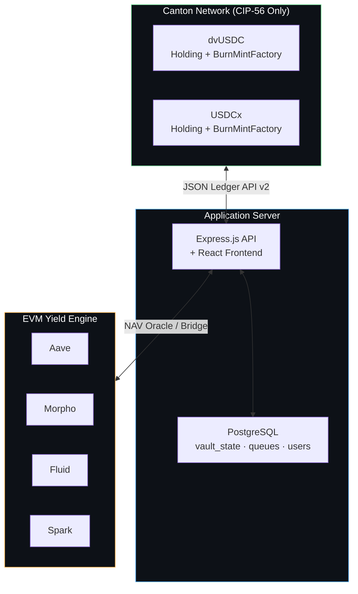
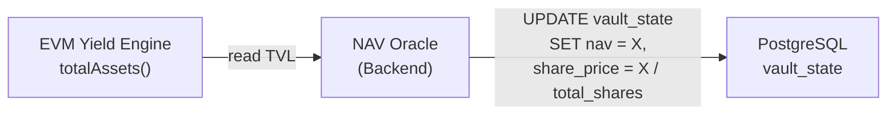
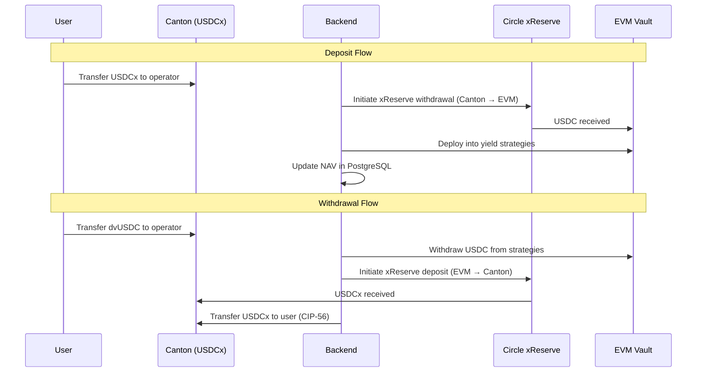
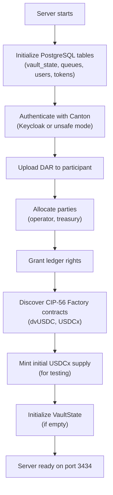
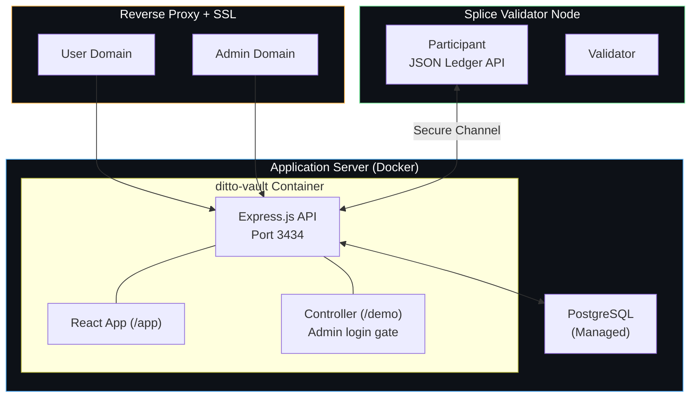

# Ditto Vault — Technical Architecture

> Canton Network · CIP-56 · Hybrid On-Chain/Off-Chain Design

---

## Table of Contents

- [1. System Overview](#1-system-overview)
- [2. On-Chain: CIP-56 Token Contracts](#2-on-chain-cip-56-token-contracts)
- [3. Off-Chain: PostgreSQL State](#3-off-chain-postgresql-state)
- [4. Memo-Based Routing](#4-memo-based-routing)
- [5. Lifecycle Flows](#5-lifecycle-flows)
- [6. Custodial vs Non-Custodial](#6-custodial-vs-non-custodial)
- [7. NAV Oracle & Pricing](#7-nav-oracle--pricing)
- [8. Cross-Chain Bridge](#8-cross-chain-bridge)
- [9. Backend Services](#9-backend-services)
- [10. Security Model](#10-security-model)
- [11. Deployment Architecture](#11-deployment-architecture)
- [12. Why Ditto?](#12-why-ditto)
- [13. References](#13-references)

---

## 1. System Overview

Ditto Vault operates with a **hybrid on-chain/off-chain architecture** across two execution environments:

- **Canton Network** — CIP-56 token contracts for dvUSDC and USDCx (mint, burn, transfer). The only Daml code deployed on-chain.
- **Application Server** — PostgreSQL for vault accounting, queue management, user state. Express.js API for business logic and frontend serving.
- **EVM Chains** — yield generation across DeFi money markets (Aave, Morpho, Fluid, Spark), secured by Ditto Network's 16 decentralized operators.

This design keeps on-chain contracts minimal (tokens only), moves all mutable vault state off-chain, and uses memo-based routing for permissionless deposit/withdrawal without requiring user party registration.



### Why Hybrid?

The initial design placed all vault state on-chain in Daml contracts (VaultState, DepositOffer, WithdrawRequest). Development experience revealed several practical issues:

1. **UTXO churn** — Every VaultState update (NAV, shares, reserves) archives and recreates the contract. The backend must continuously track the latest contract ID.
2. **Query limitations** — Canton's active contracts API ignores template filters and has a 200-element response limit, requiring client-side filtering and pagination.
3. **Transaction cost** — Every queue entry and state change costs Canton traffic credits. Queue management is pure bookkeeping that gains nothing from on-chain execution.
4. **Atomic complexity** — Combining queue clearing + token minting + state update in a single Canton transaction creates deeply nested multi-contract exercises.

Moving vault accounting to PostgreSQL eliminates all of these while preserving the most valuable on-chain component: **CIP-56 token standard compliance** for dvUSDC, enabling wallet compatibility, DvP settlement, and Featured App activity markers.

---

## 2. On-Chain: CIP-56 Token Contracts

The only Daml contracts deployed to Canton are CIP-56 token interfaces — Holding and BurnMintFactory for both dvUSDC and USDCx.

### 2.1 Token Interfaces

Each token implements two CIP-56 interfaces:

| Interface | Type | Purpose |
|---|---|---|
| **Holding** | Consuming | Represents a balance owned by a party. Consumed on transfer/burn. |
| **BurnMintFactory** | Nonconsuming | Factory for atomic burn-and-mint operations. Multiple exercises per transaction. |

The nonconsuming nature of BurnMintFactory is critical — it allows multiple token operations (deposits, mints, transfers) to reference the same factory contract in a single atomic Canton transaction.

### 2.2 dvUSDC (Vault Shares)

```
Instrument ID    : { admin: operatorParty, id: "dvUSDC" }
Token Standard   : CIP-56 (Holding + BurnMintFactory)
Precision        : Numeric(10)
```

dvUSDC represents proportional ownership of the vault's NAV. Share price increases as yield accumulates from EVM strategies.

### 2.3 USDCx (Stablecoin)

```
Instrument ID    : { admin: operatorParty, id: "USDCx" }
Token Standard   : CIP-56 (Holding + BurnMintFactory)
Precision        : Numeric(10)
```

USDCx is the deposit token. In production, this will be the Canton-native USDC stablecoin via Circle xReserve. During development, the operator mints test USDCx for validation.

### 2.4 UTXO Model

CIP-56 Holdings follow a UTXO model:

- **Mint**: Factory creates new Holding contract(s) — one per output recipient
- **Transfer**: Burns sender's Holding(s), mints new Holding(s) for recipient + change back to sender
- **Burn**: Consumes Holding(s), reduces total supply

Multiple Holdings for the same owner are valid and common. The backend aggregates all holdings to determine a party's total balance.

### 2.5 Atomic Batch Operations

The BurnMintFactory `BurnMint` choice accepts multiple input holdings and produces multiple outputs in a single exercise:

```
inputs:   [holdingCid1, holdingCid2, ...]  — consumed
outputs:  [{ owner: partyA, amount: X }, { owner: partyB, amount: Y }, ...]  — created
```

This enables atomic transfers with change, multi-recipient distributions, and combined operations in a single Canton transaction. The operator's `actAs` authority is required for all CIP-56 operations.

---

## 3. Off-Chain: PostgreSQL State

All vault accounting, queue management, and user state lives in PostgreSQL.

### 3.1 vault_state (Singleton)

```sql
CREATE TABLE vault_state (
    id              INTEGER PRIMARY KEY DEFAULT 1 CHECK (id = 1),
    nav             DECIMAL(30,10) DEFAULT 0,
    total_shares    DECIMAL(30,10) DEFAULT 0,
    share_price     DECIMAL(30,10) DEFAULT 1,
    vault_reserve   DECIMAL(30,10) DEFAULT 0,
    evm_vault_balance DECIMAL(30,10) DEFAULT 0,
    is_paused       BOOLEAN DEFAULT FALSE,
    last_nav_update TIMESTAMPTZ DEFAULT NOW()
);
```

Enforced as a singleton via `CHECK (id = 1)`. Updated atomically on every deposit clearing, withdrawal clearing, NAV update, and reserve operation.

### 3.2 deposit_queue

```sql
CREATE TABLE deposit_queue (
    id              SERIAL PRIMARY KEY,
    sender_party    VARCHAR(500) NOT NULL,
    amount          DECIMAL(30,10) NOT NULL,
    mint_target     VARCHAR(500) NOT NULL,
    withdrawal_memo TEXT DEFAULT '',
    status          VARCHAR(20) DEFAULT 'pending',
    created_at      TIMESTAMPTZ DEFAULT NOW(),
    cleared_at      TIMESTAMPTZ
);
```

Entries created when USDCx is transferred to the operator with a routing memo. `mint_target` is the Canton party that will receive dvUSDC shares.

### 3.3 withdrawal_queue

```sql
CREATE TABLE withdrawal_queue (
    id               SERIAL PRIMARY KEY,
    sender_party     VARCHAR(500) NOT NULL,
    dvusdc_amount    DECIMAL(30,10) NOT NULL,
    payout_target    VARCHAR(500) NOT NULL,
    withdrawal_memo  TEXT DEFAULT '',
    status           VARCHAR(20) DEFAULT 'pending',
    created_at       TIMESTAMPTZ DEFAULT NOW(),
    cleared_at       TIMESTAMPTZ
);
```

Entries created when dvUSDC is transferred to the operator with a routing memo. `payout_target` is the Canton party that will receive USDCx redemption.

### 3.4 users

```sql
CREATE TABLE users (
    id                  UUID PRIMARY KEY DEFAULT gen_random_uuid(),
    username            VARCHAR(255) UNIQUE NOT NULL,
    password_hash       VARCHAR(255) NOT NULL,
    mode                VARCHAR(20) NOT NULL DEFAULT 'non_custodial'
                        CHECK (mode IN ('custodial', 'non_custodial')),
    party_id            VARCHAR(500) NOT NULL,
    withdrawal_address  VARCHAR(500),
    withdrawal_memo     VARCHAR(500) DEFAULT '',
    referral_code       VARCHAR(100),
    deposit_memo        VARCHAR(500),
    custodial_dvusdcx   DECIMAL(30,10) DEFAULT 0,
    role                VARCHAR(20) DEFAULT 'user'
                        CHECK (role IN ('admin', 'user')),
    faucet_used         BOOLEAN DEFAULT FALSE,
    created_at          TIMESTAMPTZ DEFAULT NOW()
);
```

Custodial users share a treasury party on-chain. The `custodial_dvusdcx` column tracks each user's individual share balance.

### 3.5 supported_deposit_tokens

```sql
CREATE TABLE supported_deposit_tokens (
    id          SERIAL PRIMARY KEY,
    token_id    VARCHAR(100) NOT NULL,
    label       VARCHAR(255),
    enabled     BOOLEAN DEFAULT TRUE,
    created_at  TIMESTAMPTZ DEFAULT NOW()
);
```

Operator-configurable. The frontend and API use this to determine which tokens are accepted for deposits. Enables seamless migration from test tokens to production stablecoins.

---

## 4. Memo-Based Routing

The memo is the core routing primitive. It eliminates the need for user-signed workflow contracts (DepositOffer, WithdrawRequest) and enables fully permissionless interactions.

### 4.1 Memo Format

```
{targetPartyId} {optionalMemo}
```

Canton party IDs contain no spaces, so the first space-delimited token is always the target address. Everything after is the forwarding memo.

### 4.2 Deposit Memo Examples

```
# Non-custodial: mint shares to my own party
alice::1220abc...   my-reference-123

# Custodial: mint shares to treasury, credit user's DB account
ditto-treasury::1220abc...   550e8400-e29b-41d4-a716-446655440000
```

### 4.3 Why Memos?

The original design used Daml workflow contracts (DepositOffer, WithdrawRequest) signed by the user. This required:
- User party registration on the Canton participant
- User authority (actAs rights) to create the contract
- Operator authority to accept the contract
- Contract ID tracking for queue management

Memo-based routing removes all of this. Any Canton party can deposit by simply transferring tokens to the operator with a self-describing memo. The backend parses the memo, queues the operation in PostgreSQL, and the operator clears it through CIP-56 token operations.

---

## 5. Lifecycle Flows

### 5.1 Deposit Flow (USDCx → dvUSDC)

```mermaid
sequenceDiagram
    actor User
    participant BE as Backend
    participant DB as PostgreSQL
    participant CN as Canton (CIP-56)

    User->>BE: POST /api/deposit { senderPartyId, amount, memo }

    rect rgb(30, 50, 30)
        Note over BE,CN: On-Chain: Transfer USDCx
        BE->>CN: BurnMintFactory_BurnMint<br/>Burn sender USDCx<br/>Mint to operator
    end

    BE->>DB: INSERT INTO deposit_queue<br/>(sender, amount, mint_target)
    BE-->>User: Queued

    Note over BE: Operator clears queue

    BE->>DB: Read pending deposits
    BE->>DB: Read vault_state (sharePrice)
    Note over BE: sharesToMint = amount / sharePrice

    rect rgb(30, 50, 30)
        Note over BE,CN: On-Chain: Mint dvUSDC
        BE->>CN: BurnMintFactory_BurnMint<br/>Mint dvUSDC to mint_target
    end

    BE->>DB: UPDATE vault_state<br/>nav += amount<br/>total_shares += minted
    BE->>DB: UPDATE deposit_queue SET status = 'cleared'

    alt mint_target is treasury
        BE->>DB: UPDATE users SET custodial_dvusdcx += minted<br/>WHERE id = memo_uuid
    end

    BE-->>User: Shares minted
```



### 5.2 Withdrawal Flow (dvUSDC → USDCx)

```mermaid
sequenceDiagram
    actor User
    participant BE as Backend
    participant DB as PostgreSQL
    participant CN as Canton (CIP-56)

    User->>BE: POST /api/withdraw { senderPartyId, dvUsdcAmount, memo }

    rect rgb(30, 50, 30)
        Note over BE,CN: On-Chain: Transfer dvUSDC
        BE->>CN: BurnMintFactory_BurnMint<br/>Burn sender dvUSDC<br/>Mint to operator
    end

    BE->>DB: INSERT INTO withdrawal_queue<br/>(sender, amount, payout_target)
    BE-->>User: Queued

    Note over BE: Operator clears queue

    BE->>DB: Read pending withdrawals
    BE->>DB: Read vault_state (sharePrice)
    Note over BE: redemption = dvUsdcAmount × sharePrice

    rect rgb(30, 50, 30)
        Note over BE,CN: On-Chain: Burn dvUSDC + Transfer USDCx
        BE->>CN: BurnMintFactory_BurnMint<br/>Burn operator's dvUSDC
        BE->>CN: BurnMintFactory_BurnMint<br/>Transfer USDCx to payout_target
    end

    BE->>DB: UPDATE vault_state<br/>nav -= redemption<br/>total_shares -= burned
    BE->>DB: UPDATE withdrawal_queue SET status = 'cleared'
    BE-->>User: USDCx returned
```



### 5.3 Deposit Shares (dvUSDC → Custodial Account)

A direct path for crediting dvUSDC to a custodial user's account without going through the queue.

```mermaid
sequenceDiagram
    actor Sender
    participant BE as Backend
    participant DB as PostgreSQL
    participant CN as Canton (CIP-56)

    Sender->>BE: POST /api/deposit-shares { senderPartyId, amount, memo: userUUID }
    BE->>DB: Look up custodial user by UUID

    rect rgb(30, 50, 30)
        Note over BE,CN: On-Chain: Transfer dvUSDC to Treasury
        BE->>CN: BurnMintFactory_BurnMint<br/>Burn sender dvUSDC<br/>Mint to treasury
    end

    BE->>DB: UPDATE users SET custodial_dvusdcx += amount<br/>WHERE id = userUUID
    BE-->>Sender: Credited immediately
```



No queue is used. The on-chain transfer and DB credit happen in a single request.

### 5.4 Share Transfer

```mermaid
sequenceDiagram
    actor User
    participant BE as Backend
    participant DB as PostgreSQL
    participant CN as Canton (CIP-56)

    User->>BE: POST /api/user/transfer-shares { toAddress, toMemo, amount }

    alt Custodial sender
        BE->>DB: Debit custodial_dvusdcx
        rect rgb(30, 50, 30)
            Note over BE,CN: On-Chain: Transfer from Treasury
            BE->>CN: BurnMintFactory_BurnMint<br/>Burn treasury dvUSDC<br/>Mint to destination
        end
        Note over BE: If on-chain fails → rollback DB debit
    else Non-custodial sender
        rect rgb(30, 50, 30)
            Note over BE,CN: On-Chain: Direct Transfer
            BE->>CN: BurnMintFactory_BurnMint<br/>Burn sender dvUSDC<br/>Mint to destination
        end
    end

    alt Destination is custodial user
        BE->>DB: Credit custodial_dvusdcx for recipient
    end

    BE-->>User: Transfer complete
```



The backend implements **DB rollback** for custodial transfers: if the on-chain CIP-56 operation fails after the sender's DB balance has been debited, the debit is reversed.

---

## 6. Custodial vs Non-Custodial

### 6.1 Non-Custodial Mode

The user holds their own Canton party and interacts permissionlessly:

- **Registration**: Backend allocates a Canton party and grants ledger rights
- **Deposits**: User sends USDCx to operator with their party ID as memo
- **Shares**: dvUSDC is minted directly to the user's party on-chain
- **Withdrawals**: User sends dvUSDC to operator with their destination address
- **Full control**: User holds CIP-56 tokens directly, can transfer peer-to-peer

### 6.2 Custodial Mode

The user gets a managed account backed by a shared treasury party:

- **Registration**: User provides a referral code, gets a UUID and deposit memo
- **Deposit memo format**: `{treasuryPartyId} {userUUID}`
- **Shares**: dvUSDC is minted to the treasury party on-chain
- **Balance tracking**: Individual balances in PostgreSQL `custodial_dvusdcx`
- **Withdrawals**: Backend transfers from treasury on behalf of the user
- **Transfers**: Backend debits sender, transfers on-chain, credits recipient if custodial

### 6.3 Treasury Party

A dedicated Canton party (`ditto-treasury`) holds all custodial users' dvUSDC. The on-chain treasury balance equals the sum of all custodial users' `custodial_dvusdcx` balances. This invariant is maintained by crediting/debiting the DB atomically with on-chain operations.

---

## 7. NAV Oracle & Pricing

### 7.1 Share Price

```
sharePrice = nav / totalShares    (when totalShares > 0, else 1.0)

On deposit:   sharesToMint    = depositAmount / sharePrice
On withdraw:  redemptionAmount = sharesToBurn × sharePrice
Yield:        sharePrice rises as EVM yield increases NAV
```

### 7.2 NAV Update Flow



1. Backend reads total vault value from EVM vault contracts via RPC
2. Applies management fee accrual
3. Updates `nav` and `share_price` in PostgreSQL
4. No on-chain transaction required for NAV updates — purely off-chain

### 7.3 Fee Accrual

```
annualFeeRate = feeRateBps / 10000
timeFraction  = secondsSinceLastUpdate / secondsPerYear
accruedFee    = grossNAV × annualFeeRate × timeFraction
netNAV        = grossNAV - accruedFee
```

---

## 8. Cross-Chain Bridge

### 8.1 Current State (MVP)

No actual fund movement between Canton and EVM. The NAV Oracle reads EVM vault TVL and posts it to PostgreSQL. Reserve management (fund vault, bridge to/from EVM) is bookkeeping via DB updates. CIP-56 USDCx on Canton is test-minted by the operator.

### 8.2 Production (Phase 2+)

Integration with **Circle xReserve** for actual USDCx ↔ USDC bridging:



---

## 9. Backend Services

The backend is a single Express.js server handling all responsibilities:

### 9.1 Startup Sequence



### 9.2 Authentication

Dual-mode authentication for Canton Ledger API:

| Mode | Mechanism | Use Case |
|---|---|---|
| `keycloak` | OAuth2 token from Keycloak IdP | Production validators |
| `none` | No auth header, `userId: ledger-api-user` | Development / unsafe mode |

User authentication is separate — JWT-based with bcryptjs password hashing.

### 9.3 Canton Ledger API Integration

All on-chain interactions go through Canton's JSON Ledger API v2:

| Operation | API Endpoint |
|---|---|
| Upload DAR | `POST /v2/packages` |
| Allocate party | `POST /v2/parties` |
| Submit commands | `POST /v2/commands/submit-and-wait-for-transaction` |
| Query contracts | `POST /v2/state/active-contracts` |
| Get ledger offset | `GET /v2/state/ledger-end` |

The backend uses `actAs: [operatorParty]` for all commands. User parties are included as `actAs` when their authority is needed (e.g., transferring their tokens).

### 9.4 Smart Routing (Controller Dashboard)

The controller dashboard implements intelligent routing for token sends:

| Token | Memo? | Destination | Route |
|---|---|---|---|
| USDCx | Yes | Any | `POST /api/deposit` (enters deposit queue) |
| dvUSDC | Yes | Treasury | `POST /api/deposit-shares` (instant custodial credit) |
| dvUSDC | Yes | Operator | `POST /api/withdraw` (enters withdrawal queue) |
| Any | No | Any | `POST /api/transfer` (raw CIP-56 transfer) |

---

## 10. Security Model

### 10.1 Canton Security

| Control | Implementation |
|---|---|
| **CIP-56 authorization** | All BurnMintFactory operations require operator's `actAs` authority |
| **Atomic execution** | Multi-command submissions are all-or-nothing |
| **Privacy** | Canton's sub-transaction privacy ensures parties see only their own contracts |
| **Audit trail** | Every token creation and archival recorded on the Canton ledger |
| **UTXO integrity** | Holdings can only be consumed by authorized exercises |

### 10.2 Application Security

| Control | Implementation |
|---|---|
| **JWT authentication** | bcryptjs password hashing, signed JWT tokens |
| **Role-based access** | `user` and `admin` roles with middleware enforcement |
| **Operator endpoint protection** | All operator APIs (state, clearing, NAV, pause, bridge, transfers, token config) require admin JWT |
| **Controller login gate** | Full-screen auth overlay on operator dashboard, session-scoped JWT, auto-logout on expiry |
| **Domain-level filtering** | Reverse proxy blocks operator APIs on the user-facing domain |
| **DB rollback** | Custodial transfers revert DB debit if on-chain operation fails |
| **Pause mechanism** | Operator can pause all vault operations instantly |
| **Input validation** | Decimal precision capped at 10 digits (Canton Numeric limit) |
| **Configurable tokens** | Only operator-whitelisted tokens accepted for deposits |

### 10.3 Custodial Integrity

The treasury balance invariant: on-chain treasury dvUSDC = Σ(custodial users' `custodial_dvusdcx`). Maintained by:

- Crediting DB balance only after confirmed on-chain mint to treasury
- Debiting DB balance before on-chain transfer, with rollback on failure
- Direct share deposits (deposit-shares) credit DB only after confirmed on-chain transfer

### 10.4 EVM Security

| Control | Implementation |
|---|---|
| **Operator decentralization** | 16 operators across Eigenlayer and Symbiotic |
| **Strategy constraints** | Whitelisted protocols only (Aave, Morpho, Fluid, Spark) |
| **Autonomous execution** | No manual intervention, guard-rail protected |
| **Economic security** | $200M+ TVL backing across the operator set |

---

## 11. Deployment Architecture

### 11.1 Infrastructure



### 11.2 Docker Deployment

The application runs as a Docker container with `restart: unless-stopped`:

- **Image**: `node:20-slim` + python3 (for DAR manifest parsing)
- **Network**: Host mode (direct access to Canton Ledger API)
- **Volumes**: DAR files mounted read-only, persistent data directory
- **Database**: External PostgreSQL (managed service)

### 11.3 Network Isolation

User-facing and operator-facing interfaces are served on separate domains behind a reverse proxy:

- **User domain** — serves the React app and proxies only public and user-scoped API endpoints. Operator APIs and the controller dashboard are not reachable.
- **Admin domain** — proxies all endpoints. Server-side JWT middleware enforces admin authorization on operator routes.

SSL is terminated at the edge with encrypted origin connections.

### 11.4 Canton Connectivity

Two authentication modes for connecting to the Canton Ledger API:

| Environment | Auth Mode | Connection |
|---|---|---|
| Development | `none` (unsafe) | Direct or SSH tunnel to validator |
| Production | `keycloak` | OAuth2 tokens from Keycloak IdP |

### 11.5 Contract Packages

```
ditto-vault-contracts/
├── daml.yaml                     # sdk-version: 3.4.10
├── dars/                         # CIP-56 data dependencies
│   ├── splice-api-token-metadata-v1-1.0.0.dar
│   ├── splice-api-token-holding-v1-1.0.0.dar
│   └── splice-api-token-burn-mint-v1-1.0.0.dar
└── daml/
    └── DittoVault/
        ├── DvUsdcToken.daml      # dvUSDC Holding + BurnMintFactory (CIP-56)
        └── UsdcxToken.daml       # USDCx Holding + BurnMintFactory (CIP-56)
```

The DAR is uploaded automatically on server startup. Package IDs are extracted from the DAR manifest.

---

## 12. Why Ditto?

Ditto Network provides the infrastructure backbone that makes autonomous yield generation on Canton possible — without relying on centralized intermediaries or manual treasury operations.

### Decentralized Operator Network

Vault transactions on EVM are secured by **16 institutional-grade operators** actively restaked across **Eigenlayer** and **Symbiotic**. This decentralized operator set eliminates single points of failure and ensures that no individual entity can unilaterally control fund movements or strategy execution.

### Economic Security

Operators collectively secure approximately **$200M in total value locked**, providing strong economic guarantees against malicious behavior. Slashing conditions enforced by the restaking protocols align operator incentives with depositor protection.

### Autonomous Execution with Guard Rails

Yield strategies on EVM run **fully autonomously** — allocations across Aave, Morpho, Fluid, and Spark are rebalanced without manual intervention. Every rebalancing action is validated by an on-chain **guard and risk management system** that enforces:

- **Whitelisted protocols only** — the allocator cannot deposit into unapproved venues
- **Position limits** — maximum exposure per protocol to prevent concentration risk
- **Slippage protection** — rebalance transactions revert if execution deviates beyond thresholds
- **Health factor monitoring** — automated de-risking if collateral ratios approach liquidation levels

### What This Means for Canton

Canton participants interacting with Ditto Vault benefit from institutional-grade security and automation without trusting a single operator. The yield flowing back to dvUSDC holders is generated by battle-tested infrastructure that has been live on Ethereum mainnet — now extended to Canton through CIP-56 tokenization.

---

## 13. References

| Resource | Link |
|---|---|
| CIP-56 Specification | [github.com/global-synchronizer-foundation/cips](https://github.com/global-synchronizer-foundation/cips/blob/main/cip-0056/cip-0056.md) |
| Canton Quickstart | [github.com/digital-asset/cn-quickstart](https://github.com/digital-asset/cn-quickstart) |
| Splice Token Standard APIs | [docs.dev.global.canton.network](https://docs.dev.global.canton.network.sync.global/app_dev/token_standard/index.html) |
| BurnMint API | [Splice-Api-Token-BurnMintV1](https://docs.dev.global.canton.network.sync.global/app_dev/api/splice-api-token-burn-mint-v1/Splice-Api-Token-BurnMintV1.html) |
| Splice Wallet Kernel SDK | [github.com/hyperledger-labs/splice-wallet-kernel](https://github.com/hyperledger-labs/splice-wallet-kernel) |
| Registry Utility | [docs.digitalasset.com](https://docs.digitalasset.com/utilities/devnet/overview/registry-user-guide/token-standard.html) |
| Activity Markers | [docs.digitalasset.com](https://docs.digitalasset.com/utilities/devnet/overview/registry-user-guide/activity-markers.html) |
| Circle xReserve | [developers.circle.com](https://developers.circle.com/xreserve/tutorials/deposit-usdc-on-ethereum-for-usdcx-on-canton) |
| Featured App Request | [canton.foundation](https://canton.foundation/featured-app-request/) |
| Daml Documentation | [docs.digitalasset.com](https://docs.digitalasset.com/build/3.4/tutorials/smart-contracts/intro.html) |

---

*Ditto Network — [dittonetwork.io](https://dittonetwork.io) · [@Ditto_Network](https://x.com/Ditto_Network) · [GitHub](https://github.com/dittonetwork)*
