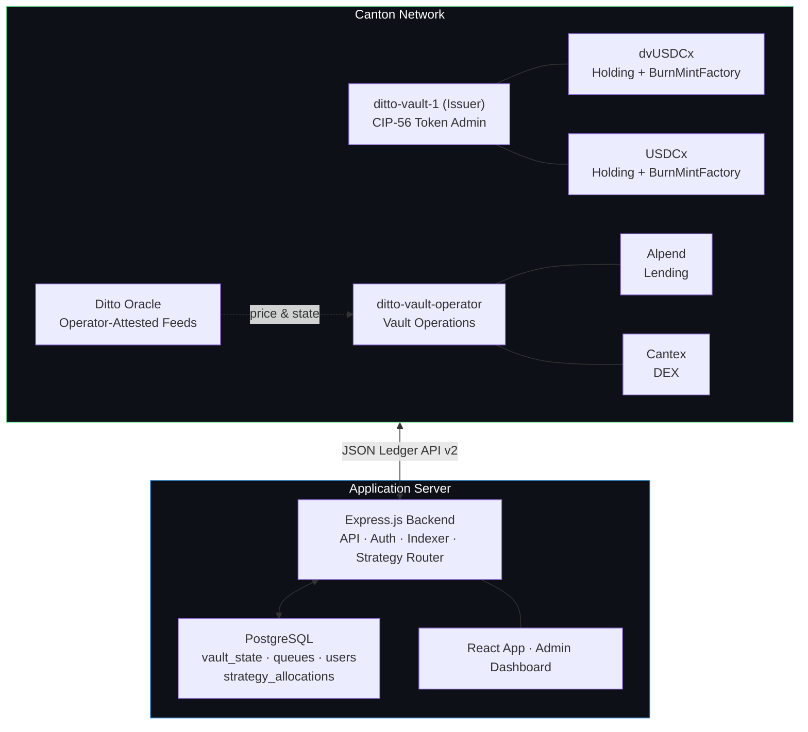
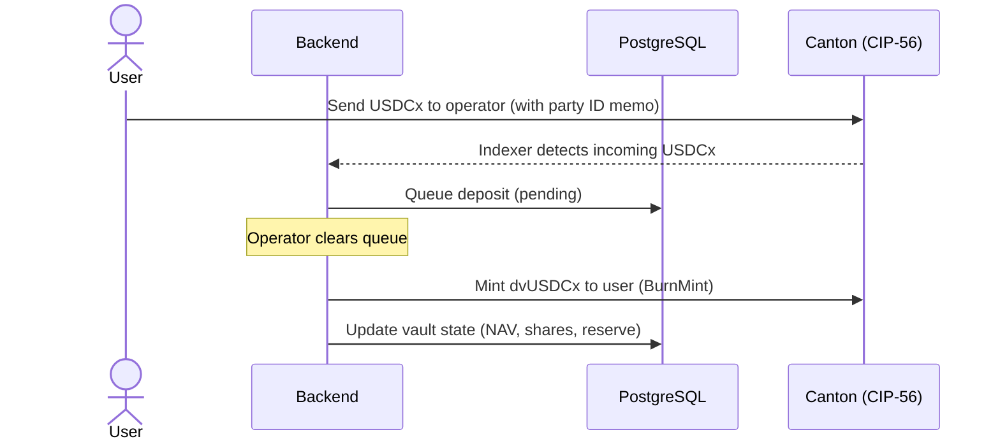

# Ditto Vault

**Canton-Native Yield Vault**

---

## Overview

Ditto Vault is a Canton-native asset management platform — a system for issuing and operating multi-strategy yield vaults on the Canton Network. The first product is `dvUSDCx`, a daily-liquid USDCx vault whose share token tracks an actively-managed allocation across Canton-native lending and DEX protocols. Additional vaults will follow the same architecture: different base assets (CC, CBTC), different lock terms (90-day, 1-year), and different strategy mixes.

There is no cross-chain bridging and no off-Canton custody: every dollar of vault NAV is held in a Canton-native protocol position or in idle reserves. All user-facing interactions are non-custodial CIP-56 transfers.

The platform is governed by Ditto Network — operator of 16 nodes across Eigenlayer and Symbiotic restaking infrastructure with $200M+ in cryptoeconomically-secured TVL — and is the reference application for the **Ditto Oracle**, an operator-attested price and state feed for the broader Canton DeFi ecosystem.

Vault accounting (NAV, share price, deposit/withdrawal queues, per-strategy allocations) lives in PostgreSQL; only token Holdings and Factories live on-chain. This separation keeps Canton traffic minimal while preserving full CIP-56 composability across the entire vault lineup.

---

## Architecture



**Three planes:** the on-chain plane is pure CIP-56 (tokens, party separation, factories). The off-chain plane is the strategy router, indexer, and accounting. The verification plane (Ditto Oracle) sits between them, providing trust-minimized prices and protocol-state attestations that the router uses for allocation and risk decisions.

---

## CIP-56 Tokens

The platform issues one dvToken per vault, all under the same `ditto-vault-1` issuer party but with distinct `instrumentId.id` values. The first token is `dvUSDCx`; additional tokens follow the same pattern.

| Token | Purpose | Standard |
|---|---|---|
| **dvUSDCx** | `dvUSDCx-CORE` vault share — daily-liquid USDCx vault | CIP-56 Holding + BurnMintFactory |
| **USDCx** | Stablecoin deposited by users, routed to strategies | CIP-56 Holding + BurnMintFactory |
| **dvUSDCx-LOCK90, dvUSDCx-LOCK1Y, dvCC, dvCBTC, …** *(future)* | Additional vault shares — different base assets, lock terms, and strategy mixes | CIP-56 Holding + BurnMintFactory |

Every dvToken is independently registered as a Canton Featured App under CIP-47 — see [Revenue Model](#revenue-model) for marker mechanics.

Both tokens implement Splice CIP-56 token-standard interfaces. Holdings follow the UTXO model — minting burns inputs and creates outputs. Factories are nonconsuming, allowing multiple mint/burn operations in a single atomic batch.

**Party Separation (CIP-47 Compliant):** A dedicated issuer party (`ditto-vault-1`) signs all CIP-56 token contracts. The operator party (`ditto-vault-operator`) manages vault operations and protocol allocations. This separation satisfies CIP-47 Rule 9 for Featured App Activity Marker eligibility.

**Metadata Passthrough:** The BurnMintFactory propagates `extraArgs.meta` into created Holdings, enabling on-chain memo tracking via the `dittonetwork.io/memo` key. The transaction indexer parses these to detect and route deposits and withdrawals automatically.

---

## Yield Strategies

The vault router allocates USDCx across four mechanically distinct strategies on two Canton-native protocols. Each strategy responds to a different market regime, so the blended return is more stable than any single leg.

| Strategy | Venue | Mechanism | Primary risk |
|---|---|---|---|
| **Passive lending** | Alpend | Plain USDCx supply at variable rate | Protocol risk, utilization spikes |
| **Looped lending** | Alpend | Recursive supply-borrow-swap-resupply, capped to a safe LTV | Rate-spread inversion, liquidation |
| **Delta-hedged LP** | Cantex + Alpend | USDCx/CC LP with short-CC hedge sized to neutralize pool delta | Imperfect hedge, hedge funding cost |
| **Naked LP** *(off by default)* | Cantex | USDCx/CC LP with no hedge | Impermanent loss |

Plus a dynamic **idle buffer** (≥10% of NAV by default) sized to absorb instant withdrawals.

The strategy router rebalances on programmatic triggers — utilization spikes, rate inversions, hedge drift, leverage bands — not on operator discretion. See [STRATEGIES.md](./STRATEGIES.md) for the full mechanics, target weights, and rebalance rule set.

**Stable/stable strategy** *(future)* — the lowest-risk leg in any USDC-denominated vault is a stable/stable LP (e.g. USDC/USDT). No counter-stable to USDCx exists on Canton today; this strategy will be enabled as soon as one ships.

---

## Ditto Oracle

Canton DeFi today has no native price oracle equivalent of Chainlink or Pyth. Lending and DEX protocols on Canton currently rely on undisclosed or self-reported price sources — a load-bearing systemic risk as TVL grows.

Ditto Network already operates a 16-node operator set across Eigenlayer and Symbiotic, securing $200M+ in restaking TVL. **Ditto Oracle** repurposes that operator set as a quorum-attested price and state feed for the Canton ecosystem:

| Feed | Content | Cadence |
|---|---|---|
| **Spot prices** | USDCx/CC, CC/USD, CBTC/USD, plus any CIP-56 token pair on demand | Per-block |
| **Protocol state** | Alpend market utilization, available liquidity, health factors; Cantex pool depth and fee accrual | Per-block |
| **RWA NAV** | Off-chain fund admin reports for tokenized credit-fund tranches *(future)* | Monthly / event-driven |
| **Cross-protocol health** | Aggregated risk attestations the strategy router uses for allocation decisions | Continuous |

The vault is the first internal consumer — every rebalance, hedge, and liquidation guard relies on these feeds — which makes the oracle dogfooded before externalization. Once proven internally, the same feeds become a separate ecosystem product available to any Canton DeFi protocol under a basis-point licensing model.

> *Ditto's role in Canton DeFi is not just to operate a vault — it is to provide the verification layer that lets vaults, lending markets, and DEXes price assets and state safely on Canton.*

---

## Key Flows

### Deposit USDCx → receive dvUSDCx shares

Users send USDCx to the vault operator with a Canton party ID memo. The transaction indexer detects the incoming transfer and queues it. When the queue is cleared, dvUSDCx shares are minted to the user at the current share price.



### Redeem dvUSDCx → receive USDCx

Users send dvUSDCx back to the operator. The indexer queues a withdrawal. On clearing, the operator burns the dvUSDCx and sends USDCx back at the current share price. If the idle buffer plus immediately-recallable strategy liquidity is insufficient, withdrawals queue with a published SLA.

### Transfer dvUSDCx

Users can transfer dvUSDCx directly to any Canton party. Standard CIP-56 transfer with no backend involvement — generates a third-party transaction eligible for asset-issuer markers.

### Strategy allocation and harvest

The router moves USDCx between the idle buffer and the four strategy adapters based on real-time APY readings (sourced from Ditto Oracle), utilization caps, and risk triggers. Harvest events realize accrued yield back into vault NAV, which is reflected in the dvUSDCx share price on the next accounting tick.

### Transaction indexer

A background service polls Canton's `/v2/updates` endpoint, watching for token movements to the operator party. Transactions carrying a `dittonetwork.io/memo` metadata key are automatically routed:

- **USDCx arriving at operator** → queued as a deposit
- **dvUSDCx arriving at operator** → queued as a withdrawal

Indexer state is crash-resilient via PostgreSQL-backed offset tracking and per-transaction deduplication.

---

## Vault Accounting

All vault state lives in PostgreSQL. NAV is **always derived** from vault holdings — never set manually.

| Field | Description |
|---|---|
| `nav` | Net Asset Value = `vault_reserve + Σ strategy_allocations.last_value` |
| `total_shares` | Total dvUSDCx shares outstanding |
| `share_price` | `nav / total_shares` — derived, never set |
| `vault_reserve` | Idle USDCx held by the operator party |
| `strategy_allocations` | Per-strategy table: protocol, asset, deployed amount, last marked value, last harvest timestamp |
| `is_paused` | Emergency pause flag |

**Yield raises share price:**

```
1. Users deposit 1000 USDCx → reserve=1000, NAV=1000, 1000 shares at $1.00
2. Router allocates 800 USDCx to Alpend passive supply
   reserve=200, alpend_supply.deployed=800, NAV=1000 (unchanged)
3. Alpend supply accrues 50 USDCx interest
   alpend_supply.last_value=850, NAV=1050, share_price=$1.05
4. User redeems 100 dvUSDCx → receives 105 USDCx (100 shares × $1.05)
```

---

## Tech Stack

| Layer | Technology |
|---|---|
| Token Contracts | Daml 3.x / CIP-56 (Holding + BurnMintFactory interfaces) |
| Network | Canton Network (Splice validator, DevNet / TestNet / MainNet) |
| Ledger API | Canton JSON Ledger API v2 (HTTP) |
| Backend | Node.js, TypeScript, Express |
| Database | PostgreSQL |
| Strategy Router | Adapter-per-protocol model (`AlpendSupply`, `AlpendLooped`, `CantexLpHedged`, `CantexLpNaked`) |
| Transaction Indexer | Background poller on `/v2/updates` with PostgreSQL state |
| User Auth | JWT (bcryptjs + jsonwebtoken) |
| Frontend (App) | React 19, Vite 7, TypeScript, Tailwind CSS v4, shadcn/ui |
| Frontend (Admin) | Vanilla HTML/JS + Tailwind CSS |
| Wallet Integration | Loop SDK (`@fivenorth/loop-sdk`) |
| Deployment | Docker Compose |

---

## User Interface

### User App (`/app`)

- Account overview with Party ID and operator address
- Portfolio cards: USDCx + dvUSDCx balances with Deposit, Redeem, and Send actions
- Deposit/Redeem via backend API (registered users) or Loop wallet (external wallet users)
- Pending deposits/withdrawals with status tracking
- Vault statistics: NAV, total shares, share price, blended APY, per-strategy allocation
- DevNet faucet for test tokens

### Admin Dashboard

- Operator authentication gate
- Real-time vault metrics: NAV, share price, total shares, vault reserve, per-strategy allocation
- Strategy router controls: allocate to / recall from any strategy adapter
- Queue management: view and clear pending deposits/withdrawals
- Vault controls: harvest strategies, pause/unpause, recompute NAV
- All-users view with on-chain USDCx and dvUSDCx balances

---

## Design Principles

1. **Canton-native only** — every strategy lives on a Canton-issued protocol. No bridges, no synthetic exposure, no off-Canton custody.
2. **Non-custodial only** — users hold their own tokens on-chain. No treasury party, no custodial balances. Maximizes third-party transaction volume for asset-issuer marker revenue.
3. **CIP-56 only on-chain** — token Holdings and Factories are the sole on-chain contracts. Vault accounting lives in PostgreSQL, reducing Canton traffic cost and UTXO complexity.
4. **Derived NAV** — NAV = vault_reserve + sum of strategy allocations. Share price is always derived, never manually set.
5. **Programmatic rebalancing** — strategy weights and risk triggers are rule-based, not operator-discretion. See [STRATEGIES.md](./STRATEGIES.md).
6. **Memo-based routing** — deposits and withdrawals use the sender's Canton party ID as a memo in `dittonetwork.io/memo`. The indexer parses and routes automatically.
7. **Separated issuer/operator parties** — `ditto-vault-1` (issuer) signs CIP-56 tokens. `ditto-vault-operator` manages vault operations. Required by CIP-47 Rule 9.
8. **Atomic CIP-56 operations** — multi-command submissions ensure all-or-nothing execution.
9. **Defense in depth** — admin JWT authentication on all operator endpoints. Reverse proxy domain-level route filtering isolates operator APIs from user-facing surfaces.

---

## Featured App Alignment

The platform is designed to satisfy each rule of the Featured App Coupon Guidance (revised 22 April 2026, effective 27 April 2026 21:00 UTC) from the Canton Tokenomics Committee.

The current guidance unifies the two coupon-generating paths — **Featured CC transfers** and **Featured App Markers** — under one set of rules. Both produce $1 of reward weight per use, and an app's total reward weight (markers + featured CC transfers) cannot exceed its net qualifying on-chain fees plus the synchronizer's free-traffic credit. Once CIP-0107 deploys to mainnet, featured CC transfers will produce on-chain markers directly, simplifying these calculations.

The platform's compliance map:

| Rule | What it requires | How the platform complies |
|---|---|---|
| **1. No redundant coupons on CC** | Coupons can come from featured CC transfers OR markers, but never both for the same activity | Operator-driven CC transfers (collateral posting on Alpend, swap legs on Cantex) are submitted **without** the Featured App Contract ID in the Transfer Context — unfeatured. The dvToken marker stream attaches only to dvToken instrument activity. |
| **2. Coupon-to-fee alignment** | Total coupon weight (markers + featured CC transfers) ≤ net qualifying on-chain fees + 0.1 MB/round free synchronizer credit | Marker submission service targets a 1.0 coupon-to-fee ratio over a 30-minute trailing window, including the 0.1 MB/round free traffic credit in the budget. |
| **3. No markers for marker submission cost** | Self-explanatory | Marker submission is batched via BatchV2; cost excluded from marker math. |
| **4. Markers only for on-chain fee-generating activity** | Off-chain reads/UI/API don't count | Only on-chain CIP-56 events (transfers, swaps, mints, burns) are claimed; oracle reads and dashboard interactions are not. |
| **5. Two-round timeliness** | Markers within ~20 minutes of underlying activity | Indexer plus marker batcher run on a 5–10 minute trigger with a 30-minute lookback window — no manual operator action. |
| **6. No net-paying users** | Cannot subsidize beyond user costs | Vault fee discounts (if any) are capped at user-borne traffic costs. |
| **7. No reward recycling** | Cannot earn markers on reward distributions | Yield distribution to vault holders is intra-vault accounting (share price ticks up); no separate distribution transactions. |
| **8. Asset issuer exception** | 1 marker per transaction submitted by a third party / transaction originator / venue, even when many asset movements are batched into one transaction | `ditto-vault-1` issues dvTokens; markers submitted on third-party-submitted transactions only, one marker per transaction regardless of dvToken movement count within that transaction. |
| **9. CIP-0056 compliance** | Asset must be holdable in 2+ wallets and tradeable on at least one DVP | Currently 1 of 2 wallets (Loop). Compliance is gated on Phase 3 deliverables: Console-wallet support and DVP listing on CantonSwap or equivalent. The platform is not eligible for asset-issuer marker rewards on a given dvToken until Phase 3 ships for that instrument. |
| **10. Separate party concerns** | Asset issuer party isolated from other functions | `ditto-vault-1` (issuer-only), `ditto-vault-operator` (vault ops, lending, LP), `ditto-oracle` (verification feeds — Phase 5). No party performs more than one major role. |

Additional alignment:

- **Economically motivated transactions** — every CIP-56 operation serves a genuine user need (deposit, withdrawal, transfer, allocation).
- **Metadata on-chain** — `dittonetwork.io/memo` key in Holding metadata enables verifiable transaction routing.
- **Featured App V2 API ready** — `splice-api-featured-app-v2` and `splice-util-featured-app-proxies` included as data dependencies for WalletUserProxy integration.
- **Composable ecosystem asset** — every dvToken is available as a CIP-56 token for any Canton application.
- **Active validator presence** — Ditto operates validators on Canton DevNet, TestNet, and MainNet.

---

## Revenue Model

Revenue compounds across the vault lineup. Each vault is its own AUM pool with its own fee schedule, and each dvToken is a CIP-56 instrument earning Canton Featured App asset-issuer markers under the Featured App Coupon Guidance (revised 22 April 2026, effective 27 April 2026 21:00 UTC).

### Per-vault fees (USDCx-denominated)

| Source | Mechanism | Indicative range |
|---|---|---|
| **Management fee** | % of vault AUM accrued continuously, charged via reduced share price | 0.5–2% annual |
| **Performance fee (carry)** | Share of yield above a published benchmark, accrued at harvest tick | 10–20% above benchmark |

Fee schedules are set per vault. Higher-risk and longer-locked vaults carry higher fees; the daily-liquid `dvUSDCx-CORE` is the lowest-fee tier. These are the **direct revenue lines** — denominated in USDCx, not subject to CC price.

### Asset-issuer markers (per dvToken, per third-party transaction)

Every dvToken is a CIP-56 instrument issued by `ditto-vault-1` and registered as a Canton Featured App under CIP-47. Per the asset-issuer rule (Rule 8 of the Featured App Coupon Guidance, revised 22 April 2026):

> Asset Issuers may submit **1 marker per transaction submitted by 3rd parties / transaction originator / venue**. Asset Issuers may only submit 1 marker even when the 3rd party batches many asset movements into a single transaction.

Each marker carries **$1 of reward weight**. Per the guidance, the ratio of reward paid to reward weight varies above and below 1:1, so realized revenue per marker is variable, not fixed. What counts as a third-party transaction for our dvTokens:

| Transaction class | Counts as third-party? | Marker stream |
|---|---|---|
| Mint at deposit clearing | ❌ — operator-submitted | None |
| Burn at redeem clearing | ❌ — operator-submitted | None |
| Peer-to-peer dvToken transfer (user-submitted from their wallet) | ✅ | 1 marker per tx |
| dvToken swap on a DVP venue (CantonSwap, Cantex, Silvana) | ✅ | 1 marker per tx |
| Composable use of dvTokens by third-party apps | ✅ | 1 marker per tx |

**Asset-issuer marker bound (Rules 1, 4, 8 combined)**: For a single dvToken instrument, the maximum issuer-claimable markers per reward round equals the number of distinct **third-party-submitted** on-chain transactions where that dvToken is genuinely used as the asset and the transaction itself generates traffic fees. Operator-submitted mints and burns at deposit/redeem clearing are excluded. Batched third-party transactions count once even when they include many dvToken movements.

**Operational consequence**: marker revenue tracks **secondary-market activity**, not deposit/redeem volume. The vault's economics depend materially on cultivating dvToken liquidity, market-maker integration, and DVP listings. This is why Phase 9 (Liquidity) is a revenue-driver, not a polish phase.

**Submission compliance**: markers are submitted by an automated backend service in batches every reward round, calibrated to a marker-to-transaction ratio of 1.0 over a 30-minute backwards-looking window — the methodology recommended in the official guidance.

Markers fire only on Canton-native transactions: dvTokens are issued and traded exclusively on Canton.

### Platform-level (future)

| Source | Mechanism |
|---|---|
| **Ditto Oracle attestation fees** | Basis-point licensing in USDCx, paid by Canton DeFi protocols consuming Ditto Oracle price/state feeds. Direct revenue, not marker-dependent. |
| **Ditto Oracle markers** | Asset-issuer markers on oracle-attestation CIP-56 transactions when consumed by third-party protocols. Subject to ongoing alignment review with Canton Foundation; assumed material only at scale. |

---

## Roadmap

| Phase | Status | Scope |
|---|---|---|
| **Phase 1 — MVP** | ✅ Complete | CIP-56 tokens, deposit/withdraw queues, PostgreSQL vault accounting, React UI, Docker, DevNet validator |
| **Phase 2 — V2 Architecture** | ✅ Complete | Non-custodial only, party separation, metadata passthrough, transaction indexer, yield-based NAV, Loop wallet, admin dashboard |
| **Phase 3 — Featured App** | 🟡 In progress | Committee review, CIP-56 compliance validation, FeaturedAppRight + WalletUserProxy integration, activity markers, DAR vetting on global topology |
| **Phase 4 — Strategy Router** | 🔵 Planned | Adapter framework, AlpendSupply + AlpendLooped + CantexLpHedged + CantexLpNaked, allocator + rebalancer, risk monitor |
| **Phase 5 — Ditto Oracle (Internal)** | 🔵 Planned | Operator-quorum attestation contracts, on-chain feed publication, vault router integration |
| **Phase 6 — Ditto Oracle (External)** | 🔵 Planned | Externalize feeds to Canton DeFi protocols, basis-point licensing model |
| **Phase 7 — Vault Lineup Expansion** | 🔵 Planned | Additional vault products: `dvUSDCx-LOCK90`, `dvUSDCx-LOCK1Y`, `dvCC`, `dvCBTC`. Each its own CIP-56 instrument, fee schedule, and marker stream. |
| **Phase 8 — Private Credit Tranche** | 🔵 Planned | SPV-wrapped credit fund tokens via dedicated locked-vault product (`dvUSDCx-LOCK1Y` with credit-fund strategy enabled), targeting illiquid double-digit yield |
| **Phase 9 — Liquidity** | 🔵 Planned | Secondary market for dvTokens via CantonSwap / Silvana, cross-app composability, market-making to drive marker velocity |

---

## About Ditto Network

**Canton Network presence**
- Validator operator on Canton DevNet, TestNet, and MainNet
- Active participant in the Canton ecosystem since early access
- CIP-56 token integration with working deposit/withdrawal/transfer flows
- CIP-47 Featured App readiness with party separation and metadata passthrough

**DeFi infrastructure track record**
- 16 node operators across Eigenlayer and Symbiotic restaking protocols
- Over $200M in TVL secured by a decentralized, slashable operator set
- Multi-year track record of running automated yield strategies and verifiable on-chain operations

---

## Documentation

- [ARCHITECTURE.md](./ARCHITECTURE.md) — full technical architecture
- [STRATEGIES.md](./STRATEGIES.md) — yield strategy mechanics, target weights, rebalance triggers, risk parameters

---

[dittonetwork.io](https://dittonetwork.io) · [@Ditto_Network](https://x.com/Ditto_Network) · [GitHub](https://github.com/dittonetwork)
