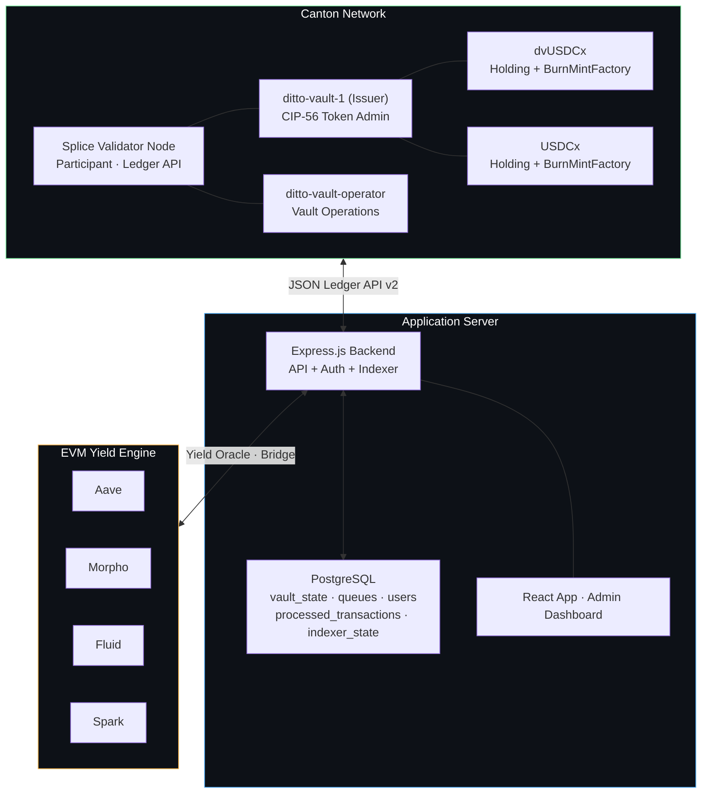
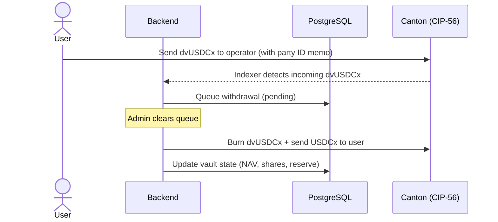

# Ditto Vault

**Yield-Bearing Vault Token on Canton Network**

---

## Overview

Ditto Vault brings risk-adjusted yield from EVM DeFi to Canton Network through a CIP-56-compliant vault token (**dvUSDCx**). Users deposit USDCx stablecoins and receive dvUSDCx — a yield-bearing share token backed by returns from leading DeFi money markets. Yield generation is fully autonomous and secured by Ditto Network's decentralized operator set of 16 operators across Eigenlayer and Symbiotic, securing over $200M in TVL.

All interactions are **non-custodial** — users hold their own tokens in their own Canton wallet. The vault operates with a hybrid on-chain/off-chain architecture: **CIP-56 token contracts** handle all token movements on Canton, while **PostgreSQL** manages vault accounting, deposit/withdrawal queues, and share price tracking. This separation minimizes on-chain complexity while preserving full CIP-56 compliance for token interoperability.

---

## Architecture



---

## CIP-56 Tokens

| Token | Purpose | Standard |
|---|---|---|
| **dvUSDCx** | Vault share token — proportional ownership of vault NAV | CIP-56 Holding + BurnMintFactory |
| **USDCx** | Stablecoin — deposited by users, held by operator | CIP-56 Holding + BurnMintFactory |

Both tokens implement the Splice CIP-56 token standard interfaces. Holdings follow the UTXO model — minting burns inputs and creates outputs. Factories are nonconsuming, allowing multiple mint/burn operations in a single atomic batch.

**Party Separation (CIP-47 Compliant):** A dedicated issuer party (`ditto-vault-1`) signs all CIP-56 token contracts. The operator party (`ditto-vault-operator`) manages vault operations. This separation satisfies CIP-47 Rule 9 for Featured App Activity Marker eligibility.

**Metadata Passthrough:** The BurnMintFactory propagates `extraArgs.meta` into created Holdings, enabling on-chain memo tracking via a `dittonetwork.io/memo` key. This allows the transaction indexer to detect and route token movements automatically.

---

## Key Flows

### Deposit USDCx → Receive dvUSDCx Shares

Users send USDCx to the vault operator. The transaction indexer detects the incoming transfer and queues it. When the admin clears the queue, dvUSDCx shares are minted to the user at the current share price.


### Redeem dvUSDCx → Receive USDCx

Users send dvUSDCx back to the operator. The indexer queues it as a withdrawal. On clearing, the operator burns the dvUSDCx and sends USDCx back at the current share price.



### Transfer dvUSDCx

Users can transfer dvUSDCx directly to any Canton party. This is a standard CIP-56 transfer with no backend involvement — it generates a 3rd-party transaction eligible for asset issuer markers.

### Transaction Indexer

A background service polls Canton's `/v2/updates` endpoint every 10 seconds, watching for token movements to the operator party. Transactions carrying a `dittonetwork.io/memo` metadata key are automatically routed:

- **USDCx arriving at operator** → queued as a deposit
- **dvUSDCx arriving at operator** → queued as a withdrawal

All indexer operations are crash-resilient via PostgreSQL-backed offset tracking and transaction deduplication.

---

## Vault Accounting & Yield

All vault state management happens in PostgreSQL:

| Field | Description |
|---|---|
| `nav` | Net Asset Value = `vault_reserve + evm_vault_balance` |
| `total_shares` | Total dvUSDCx shares outstanding |
| `share_price` | `nav / total_shares` — derived, never set manually |
| `vault_reserve` | USDCx available for withdrawals on Canton |
| `evm_vault_balance` | Capital deployed to EVM yield strategies |
| `is_paused` | Emergency pause flag |

**NAV is always derived** from the sum of vault reserve and EVM vault balance. It cannot be set to an arbitrary value.

**How yield raises share price:**

```
1. Users deposit 1000 USDCx → reserve=1000, NAV=1000, 1000 shares at $1.00
2. Operator bridges 800 to EVM → reserve=200, EVM=800, NAV=1000 (unchanged)
3. EVM earns 100 yield → EVM=900, NAV=1100, share_price=$1.10
4. User redeems 100 dvUSDCx → gets 110 USDCx (100 shares × $1.10)
```

---

## Tech Stack

| Layer | Technology |
|---|---|
| Token Contracts | Daml 3.x / CIP-56 (Holding + BurnMintFactory interfaces) |
| Network | Canton Network (Splice validator, DevNet / MainNet) |
| Ledger API | Canton JSON Ledger API v2 (HTTP) |
| Backend | Node.js, TypeScript, Express |
| Database | PostgreSQL |
| Transaction Indexer | Background poller on `/v2/updates` with PostgreSQL state |
| User Auth | JWT (bcryptjs + jsonwebtoken) |
| Frontend (App) | React 19, Vite 7, TypeScript, Tailwind CSS v4, shadcn/ui |
| Frontend (Admin) | Vanilla HTML/JS + Tailwind CSS |
| Wallet Integration | Loop SDK (`@fivenorth/loop-sdk`) |
| Deployment | Docker Compose |

---

## User Interface

### User App (`/app`)

- Account overview with Party ID and operator address
- Portfolio cards: USDCx + dvUSDCx balances with Deposit, Redeem, and Send actions
- Deposit/Redeem via backend API (registered users) or Loop wallet SDK (wallet users)
- Pending deposits/withdrawals with status tracking
- Vault statistics (NAV, total shares, share price)
- DevNet faucet for test tokens

### Admin Dashboard (`/demo`)

- Operator authentication gate
- Real-time vault metrics: NAV, Share Price, Total Shares, Vault Reserve, EVM Balance
- Operator transfer form for raw CIP-56 transfers
- Queue management: view and clear pending deposits/withdrawals
- Vault controls: Add Yield, Fund Reserve, Bridge to/from EVM, Pause/Unpause
- All user balances table with on-chain USDCx and dvUSDCx

---

## Design Principles

1. **Non-custodial only** — Users hold their own tokens on-chain. No treasury party, no custodial balances. Maximizes 3rd-party transaction volume for asset issuer marker revenue.
2. **CIP-56 only on-chain** — Token Holdings and Factories are the sole on-chain contracts. Vault accounting lives in PostgreSQL, reducing Canton traffic cost and UTXO complexity.
3. **Derived NAV** — NAV = vault_reserve + evm_vault_balance. Share price is always derived, never manually set, preventing accounting errors.
4. **Memo-based routing** — Deposits and withdrawals use the sender's Canton party ID as a memo in the `dittonetwork.io/memo` metadata key. The indexer parses and routes automatically.
5. **Separated issuer/operator parties** — `ditto-vault-1` (issuer) signs CIP-56 token contracts. `ditto-vault-operator` manages vault operations. Required by CIP-47 Rule 9.
6. **Atomic CIP-56 operations** — Multi-command submissions ensure all-or-nothing execution for token operations.
7. **Defense in depth** — Admin JWT authentication on all operator endpoints. Reverse proxy domain-level route filtering isolates operator APIs from the user-facing surface.

---

## Featured App Alignment

Ditto Vault is designed for Canton Featured App compliance (CIP-47):

- **Full CIP-56 compliance** — dvUSDCx and USDCx use BurnMintFactory for standard-compatible mint, burn, and transfer operations with metadata passthrough
- **Party separation (Rule 9)** — dedicated issuer party (`ditto-vault-1`) separate from operator, enabling asset issuer markers
- **Non-custodial design** — all user interactions are 3rd-party transactions from the user's own wallet/participant, maximizing asset issuer marker revenue (~$0.91 net per external transaction vs ~$0.17 self-submitted)
- **Economically motivated transactions** — every CIP-56 operation serves a genuine user need (deposit, withdrawal, transfer)
- **Metadata on-chain** — `dittonetwork.io/memo` key in Holding metadata enables verifiable transaction routing
- **Featured App V2 API ready** — `splice-api-featured-app-v2` and `splice-util-featured-app-proxies` included as data dependencies for WalletUserProxy integration
- **Composable ecosystem asset** — dvUSDCx is available as a CIP-56 token for any Canton application (Loop wallet, CantonSwap, Silvana)
- **Active validator presence** — Ditto operates validators on Canton DevNet, TestNet, and MainNet

---

## Revenue Model

Self-sustaining revenue from protocol operations and Canton network rewards.

| Source | Mechanism |
|---|---|
| **Management Fee** | 0.5–2% annual on AUM, deducted from yield |
| **Performance Fee** | Share of yield above benchmark |
| **Featured App Rewards** | CIP-47 activity markers on every CIP-56 transaction (up to $1.50/tx) |

---

## Roadmap

| Phase | Status | Scope |
|---|---|---|
| **Phase 1 — MVP** | **Complete** | CIP-56 tokens, deposit/withdraw queues, PostgreSQL vault accounting, React UI, Docker deployment, DevNet validator |
| **Phase 2 — V2 Architecture** | **Complete** | Non-custodial only, party separation (issuer/operator), metadata passthrough, transaction indexer, yield-based NAV, Loop wallet integration, admin dashboard |
| **Phase 3 — Featured App** | In Progress | Committee review, CIP-56 compliance validation, FeaturedAppRight + WalletUserProxy integration, activity markers, DAR vetting on global topology |
| **Phase 4 — Bridge** | Planned | Circle xReserve integration for USDCx on/off-ramp, end-to-end fund movement |
| **Phase 5 — Liquidity** | Planned | On-chain secondary market via CantonSwap/Silvana listing, yield distribution |

---

## About Ditto Network

**Canton Network Presence**
- Validator operator on Canton DevNet, TestNet, and MainNet
- Active participant in Canton ecosystem since early access
- CIP-56 token integration with working deposit/withdrawal/transfer flows
- CIP-47 Featured App readiness with party separation and metadata passthrough

**DeFi Infrastructure Track Record**
- 16 node operators across Eigenlayer and Symbiotic restaking protocols
- Over $200M in TVL secured by a decentralized operator set
- Autonomous yield generation across Aave, Morpho, Fluid, and Spark
- Live, battle-tested cross-chain automation and vault management platform

---

[dittonetwork.io](https://dittonetwork.io) · [@Ditto_Network](https://x.com/Ditto_Network) · [GitHub](https://github.com/dittonetwork)
