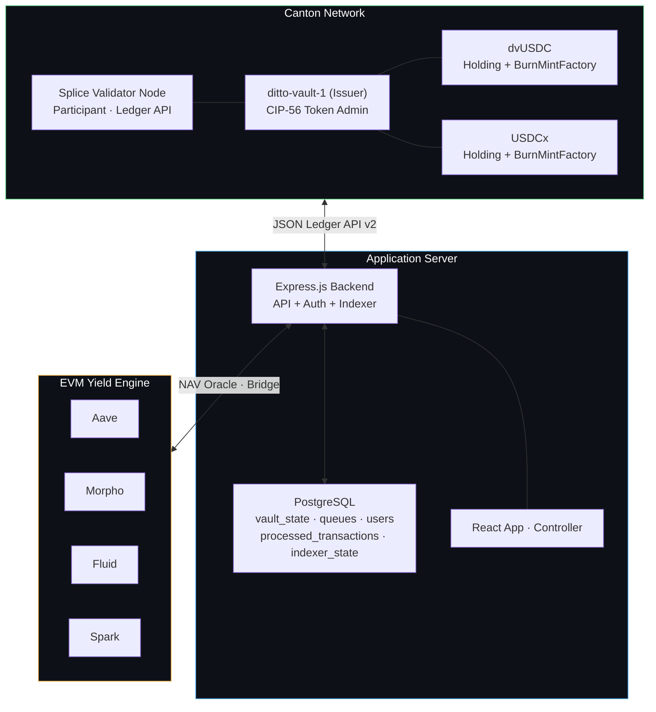
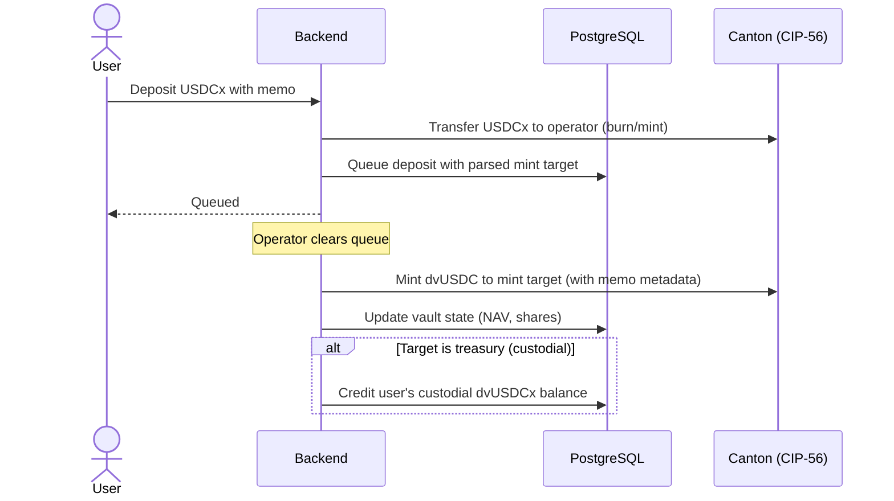
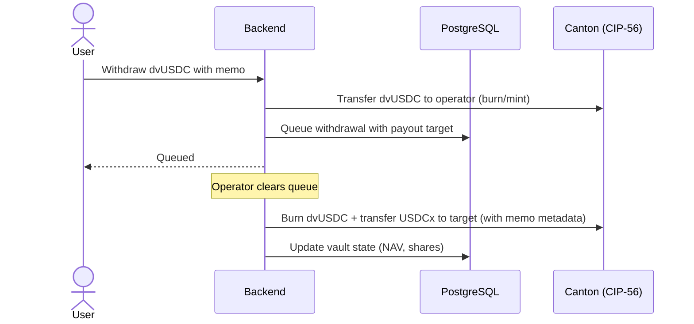

# Ditto Vault

**Yield-Bearing Vault Token on Canton Network**

---

## Overview

Ditto Vault bridges risk-adjusted yield from EVM DeFi to Canton Network through a CIP-56-compliant vault token (**dvUSDC**). Users deposit supported stablecoins on Canton and receive dvUSDC — a yield-bearing token backed by returns from leading DeFi money markets. Yield generation is fully autonomous and secured by Ditto Network's decentralized operator set of 16 operators across Eigenlayer and Symbiotic, securing over $200M in TVL.

The vault operates with a hybrid on-chain/off-chain architecture: **CIP-56 token contracts** handle all token movements on Canton, while **PostgreSQL** manages vault accounting, deposit/withdrawal queues, and user state. This separation minimizes on-chain complexity and cost while preserving full CIP-56 compliance for token interoperability.

---

## Architecture



---

## CIP-56 Tokens

| Token | Purpose | Standard |
|---|---|---|
| **dvUSDC** | Vault share token — proportional ownership of vault NAV | CIP-56 Holding + BurnMintFactory |
| **USDCx** | Stablecoin — deposited by users, held by operator | CIP-56 Holding + BurnMintFactory |

Both tokens implement the Splice CIP-56 token standard interfaces. Holdings follow the UTXO model — minting burns inputs and creates outputs. Factories are nonconsuming, allowing multiple mint/burn operations in a single atomic batch.

**Party Separation (CIP-47 Compliant):** A dedicated issuer party (`ditto-vault-1`) signs all CIP-56 token contracts and holds the `FeaturedAppRight`. The operator party (`ditto-vault-operator`) manages vault operations only. This separation satisfies CIP-47 Rule 9 for Featured App Activity Marker eligibility.

**Metadata Passthrough:** The BurnMintFactory propagates `extraArgs.meta` into created Holdings, enabling on-chain memo tracking via a `dittonetwork.io/memo` key. This allows the transaction indexer to detect and route token movements automatically.

---

## Key Flows

### Memo-Based Routing

All deposits and withdrawals use a self-describing memo: `{targetPartyId} {optionalMemo}`. The backend parses the target address and forwarding memo from this format. No Canton party registration is required for core deposit/withdraw functionality.

### Transaction Indexer

A background service polls Canton's `/v2/updates` endpoint every 10 seconds, watching for token movements to operator and treasury parties. Transactions carrying a `dittonetwork.io/memo` metadata key are automatically routed:

- **Tokens arriving at treasury** → credited to the custodial user identified by the memo (UUID)
- **USDCx arriving at operator** → queued as a deposit with the memo-specified mint target
- **dvUSDCx arriving at operator** → queued as a withdrawal with the memo-specified payout target

All indexer operations are crash-resilient via PostgreSQL-backed state tracking (`processed_transactions` + `indexer_state` tables).

### Deposit USDCx → Get Shares

Any Canton party sends supported stablecoins to the operator address with a memo specifying where to mint dvUSDC shares.



### Deposit to Custodial Account

Custodial users receive a treasury address and their user UUID. Anyone can send USDCx or dvUSDCx to the treasury with the UUID as memo. The transaction indexer detects the incoming tokens and credits the user's custodial balance immediately — no queue needed for direct treasury deposits.

### Withdraw dvUSDC → Get USDCx

Any Canton party sends dvUSDC to the operator address with a memo specifying where to send USDCx redemption.



### Custodial Mint & Burn

Custodial users can convert between USDCx and dvUSDCx within their custody:

- **Mint dvUSDCx** — converts custodial USDCx to vault shares. Backend transfers USDCx from treasury to operator, enters the deposit queue, and after clearing, credits custodial dvUSDCx.
- **Burn dvUSDCx** — converts vault shares back to USDCx. Backend transfers dvUSDCx from treasury to operator, enters the withdrawal queue, and after clearing, credits custodial USDCx.

Both flows use the standard deposit/withdrawal pipeline with the treasury as sender.

### Transfer Shares

Authenticated users can transfer dvUSDC between wallets (custodial-to-custodial, custodial-to-non-custodial, or vice versa) through the application API.

---

## Interaction Modes

### Non-Custodial

Users provide their own Canton party ID and interact permissionlessly. Shares are held directly by their party on-chain. No registration is required — the memo carries all routing information.

### Custodial

Users register through the application and receive a deposit memo containing the treasury address and their user ID. Both USDCx and dvUSDCx are tracked in PostgreSQL. Custodial users have four actions available:

| Action | Description |
|---|---|
| **Mint dvUSDCx** | Convert custodial USDCx into vault shares |
| **Burn dvUSDCx** | Convert vault shares back into USDCx |
| **Withdraw USDCx** | Send USDCx from custody to an external Canton wallet |
| **Withdraw dvUSDCx** | Send dvUSDCx from custody to an external Canton wallet |

---

## Tech Stack

| Layer | Technology |
|---|---|
| Token Contracts | Daml 3.x / CIP-56 (Holding + BurnMintFactory interfaces) |
| Network | Canton Network (Splice validator, DevNet + MainNet) |
| Ledger API | Canton JSON Ledger API v2 (HTTP) |
| Backend | Node.js, TypeScript, Express |
| Database | PostgreSQL |
| Transaction Indexer | Background poller on `/v2/updates` with PostgreSQL state |
| User Auth | JWT (bcryptjs + jsonwebtoken) |
| Frontend (App) | React, Vite, TypeScript, Tailwind CSS, shadcn/ui |
| Frontend (Controller) | Vanilla HTML/JS + Tailwind CSS |
| Deployment | Docker Compose |

---

## User Interface

### User Dashboard (`/app`)

- **Deposit Info Card** — always-visible deposit address and memo for USDCx and dvUSDCx
- **Custodial Actions** — 2x2 grid: Mint dvUSDCx, Burn dvUSDCx, Withdraw USDCx, Withdraw dvUSDCx
- **Non-Custodial Actions** — Withdraw dvUSDCx, Send dvUSDCx
- Balance cards showing USDCx, dvUSDCx holdings, share value, and total portfolio value
- Pending items (deposits and withdrawals in clearing queue)
- Vault statistics (NAV, total shares, share price)

### Controller Dashboard (`/demo`)

- **Admin login required** — full-screen authentication gate, JWT-based
- Operator and test-user send forms with intelligent routing
- Queue management (view/clear pending deposits and withdrawals)
- Vault controls (fund reserve, bridge to/from EVM, update NAV, pause)
- Configurable supported deposit tokens (USDCx + dvUSDCx by default)
- All balances (on-chain + custodial DB, including custodial USDCx)

---

## Design Principles

1. **CIP-56 only on-chain** — Token Holdings and Factories are the sole on-chain contracts. Vault accounting lives in PostgreSQL, reducing Canton traffic cost and UTXO complexity.
2. **Permissionless memo routing** — No registration needed. Deposit/withdrawal memos carry all routing information, enabling any Canton party to interact.
3. **Custodial option** — Users who prefer a managed experience share a treasury party. Individual USDCx and dvUSDCx balances tracked off-chain with DB rollback protection on chain failures.
4. **Configurable deposit tokens** — Operator can add/remove accepted tokens via the database, enabling seamless migration from test tokens to production stablecoins.
5. **Atomic CIP-56 operations** — Multi-command submissions ensure all-or-nothing execution for token operations.
6. **Separated issuer/operator parties** — `ditto-vault-1` (issuer) signs CIP-56 token contracts. `ditto-vault-operator` manages vault operations. Required by CIP-47 Rule 9 for Featured App marker eligibility.
7. **Defense in depth** — All operator endpoints require admin JWT authentication. The controller dashboard enforces a login gate. A reverse proxy provides domain-level route filtering, isolating operator APIs from the user-facing surface.
8. **Metadata passthrough** — BurnMintFactory propagates `extraArgs.meta` into Holdings, enabling the transaction indexer to detect and route token movements by reading on-chain metadata.

---

## Vault Accounting

All vault state management happens in PostgreSQL:

| Field | Description |
|---|---|
| `nav` | Total vault value in USDC terms |
| `total_shares` | Total dvUSDC shares outstanding |
| `share_price` | `nav / total_shares` — updated on every deposit/withdrawal clearing |
| `vault_reserve` | USDCx available for withdrawals |
| `evm_vault_balance` | Capital deployed to EVM yield strategies |
| `is_paused` | Emergency pause flag — blocks all operations |

**Share price calculation:**
```
On deposit:  sharesToMint    = depositAmount / sharePrice
On withdraw: redemptionAmount = sharesToBurn × sharePrice
Yield:       sharePrice increases as NAV grows from EVM yield
```

---

## API

### Public (No Authentication)

| Method | Endpoint | Description |
|---|---|---|
| POST | `/api/auth/register` | Register (custodial or non-custodial) |
| POST | `/api/auth/login` | Login, returns JWT |
| POST | `/api/deposit` | Deposit stablecoins `{ senderPartyId, amount, memo, tokenType? }` |
| POST | `/api/deposit-shares` | Deposit dvUSDC to custodial user `{ senderPartyId, amount, memo }` |
| POST | `/api/withdraw` | Withdraw dvUSDC `{ senderPartyId, dvUsdcAmount, memo }` |
| GET | `/api/deposit-tokens` | List supported deposit tokens (read-only) |
| POST | `/api/registry/transfer-factory` | Registry info for external wallets (factory IDs, memo format) |

### User (JWT Required)

| Method | Endpoint | Description |
|---|---|---|
| GET | `/api/auth/me` | Current user profile, balances, deposit memo |
| GET | `/api/user/portfolio` | Balances (USDCx + dvUSDCx), pending items, vault stats |
| POST | `/api/user/transfer-shares` | Transfer dvUSDC to another wallet |
| POST | `/api/user/custodial-withdraw` | Custodial withdrawal (dvUSDCx → USDCx to destination) |
| POST | `/api/user/custodial-mint` | Convert custodial USDCx → dvUSDCx (queued) |
| POST | `/api/user/custodial-burn` | Convert custodial dvUSDCx → USDCx (queued) |
| POST | `/api/user/custodial-withdraw-usdcx` | Send custodial USDCx to external wallet |
| POST | `/api/user/custodial-withdraw-dvusdcx` | Send custodial dvUSDCx to external wallet |
| POST | `/api/user/faucet` | Mint test USDCx (non-custodial, one-time) |

### Operator (JWT + Admin Role Required)

All operator endpoints require a valid JWT token with `role: admin`. Unauthorized requests receive 401/403.

| Method | Endpoint | Description |
|---|---|---|
| GET | `/api/state` | Full vault state + on-chain balances + queues |
| POST | `/api/process-deposits` | Clear pending deposits (with memo metadata passthrough) |
| POST | `/api/process-withdrawals` | Clear pending withdrawals (with memo metadata passthrough) |
| POST | `/api/update-nav` | Update NAV and share price |
| POST | `/api/transfer` | Raw CIP-56 transfer between parties |
| POST | `/api/fund-vault` | Designate USDCx as vault reserve |
| POST | `/api/bridge-to-evm` | Record capital deployed to EVM |
| POST | `/api/bridge-from-evm` | Record capital returned from EVM |
| POST | `/api/pause` | Toggle vault pause/unpause |
| POST | `/api/deposit-tokens` | Add supported deposit token |
| DELETE | `/api/deposit-tokens/:id` | Remove supported deposit token |

---

## Security

### Endpoint Protection

All operator and controller API endpoints require JWT authentication with admin role. This covers vault state access, queue clearing, NAV updates, pause control, token transfers, bridge operations, and deposit token configuration. Public endpoints (deposit, withdraw, deposit-shares, deposit-tokens list) remain open for permissionless interaction.

### Controller Dashboard

The operator controller requires admin authentication via a login gate. All dashboard API calls include authorization headers, and expired or invalid tokens trigger automatic re-authentication.

### Network Isolation

User-facing and operator-facing surfaces are served on separate domains with reverse proxy route filtering. Operator APIs and the controller dashboard are not reachable from the user-facing domain.

### Custodial Integrity

The treasury balance invariant (on-chain treasury dvUSDC ≥ sum of custodial users' DB balances) is maintained by crediting/debiting the database atomically with on-chain CIP-56 operations. DB rollback protects against partial failures. The transaction indexer uses PostgreSQL transactions with `processed_transactions` deduplication to prevent double-crediting.

---

## Featured App Alignment

Ditto Vault is designed for Canton Featured App compliance (CIP-47):

- **Full CIP-56 compliance** — dvUSDC and USDCx use BurnMintFactory for standard-compatible mint, burn, and transfer operations with metadata passthrough
- **Party separation (Rule 9)** — dedicated issuer party (`ditto-vault-1`) separate from operator, enabling asset issuer markers
- **Economically motivated transactions** — every CIP-56 operation serves a genuine user need (deposit, withdrawal, transfer, custodial mint/burn)
- **Metadata on-chain** — `dittonetwork.io/memo` key in Holding metadata enables verifiable transaction routing
- **Featured App V2 API ready** — `splice-api-featured-app-v2` and `splice-util-featured-app-proxies` included as data dependencies for WalletUserProxy integration
- **Institutional controls** — operator-gated clearing with full audit trail
- **Composable ecosystem asset** — dvUSDC is available as a CIP-56 token for any Canton application
- **Active validator presence** — Ditto operates validators on Canton DevNet, TestNet, and MainNet

---

## Revenue Model

Self-sustaining revenue from protocol operations and Canton network rewards.

| Source | Mechanism |
|---|---|
| **Management Fee** | 0.5–2% annual on AUM, deducted from yield |
| **Performance Fee** | Share of yield above benchmark |
| **Featured App Rewards** | CIP-47 activity markers on every CIP-56 transaction (up to $1.50/tx) |

---

## Roadmap

| Phase | Status | Scope |
|---|---|---|
| **Phase 1 — MVP** | **Complete** | CIP-56 tokens, memo-based deposit/withdraw, custodial/non-custodial modes, PostgreSQL queues, React UI, Docker deployment, DevNet + MainNet validators |
| **Phase 1.5 — Production Architecture** | **Complete** | Party separation (issuer/operator), metadata passthrough, transaction indexer, custodial USDCx tracking, four custodial actions, registry API, Featured App data dependencies |
| **Phase 2 — Bridge** | Planned | Circle xReserve integration for USDCx ↔ USDC bridging, end-to-end fund movement |
| **Phase 3 — Featured App** | In Progress | Committee review, CIP-56 compliance validation, security audit, FeaturedAppRight + WalletUserProxy integration, activity markers |
| **Phase 4 — Liquidity** | Planned | On-chain secondary market for instant exits, yield distribution mechanism |

---

## About Ditto Network

**Canton Network Presence**
- Validator operator on Canton DevNet, TestNet, and MainNet
- Active participant in Canton ecosystem since early access
- CIP-56 token integration with working deposit/withdrawal/transfer flows
- CIP-47 Featured App readiness with party separation and metadata passthrough

**DeFi Infrastructure Track Record**
- 16 node operators across Eigenlayer and Symbiotic restaking protocols
- Over $200M in TVL secured by a decentralized operator set
- Autonomous yield generation across Aave, Morpho, Fluid, and Spark
- Live, battle-tested cross-chain automation and vault management platform

---

[dittonetwork.io](https://dittonetwork.io) · [@Ditto_Network](https://x.com/Ditto_Network) · [GitHub](https://github.com/dittonetwork)
